# 企业财报数智化解决方案

## 一、作者介绍

- 掌握FineBI的使用方法和技巧,熟悉BI业务流程,提升BI熟练程度;
- 进行基于BI工具构建适合多公司财报多因子智能分析模型技术验证;
- 希望后期能把FineBI自助分析场景融入到自编脚本程序中,最终推出一款开源的财务数智化解决方案。

---

## 二、作品介绍

### 1.需求背景

- 某集团公司投资管理部门经常会基于财报数据对拟投资公司开展财务诊断评审与尽调工作,同时也要定期对公司已投资及下属公司进行阶段性管理评审,每家公司评审工作都要团队花费1-2周时间,费时费力费资源!
- 此外,企业外部审计、尽调、投资人员也会经常遇到类似的工作场景。

---

### 2.需求痛点

- 财务类**管理评审**,**投资调查**,**审计或尽调**类工作**费时费力**,**频率高**,**投入大**;
- 具体工作涉及**数据量大**,**维度指标繁杂**,实现高效,直观结果展示**难度高**;
- 深度分析工作对IT,经营,业务,决策等**专业要求**都很高,此类**工作难度较高**。
- **IT人力与硬件成本高**,使得很多中小型企业望而却步;
- **传统财务软件报表功能简单,无法满足数智化需求**。

---

### 3.立项准备

#### 3.1  确定主题:企业财报数智化解决方案

- 注意事项:
  - 财报数智化是指基于企业三大基础报表及财务报告数据开展自动化数据建模,因子分析,财务质量效率诊断评价等行为。
  - 需要特别注意切不可混淆财报数智化和财务数智化的概念。

#### 3.2 制定计划

- 因考虑到此前并未使用过FineBI工具,报名时间相对较晚,为确保按时完成作品设计,特做了个精细的作业计划。
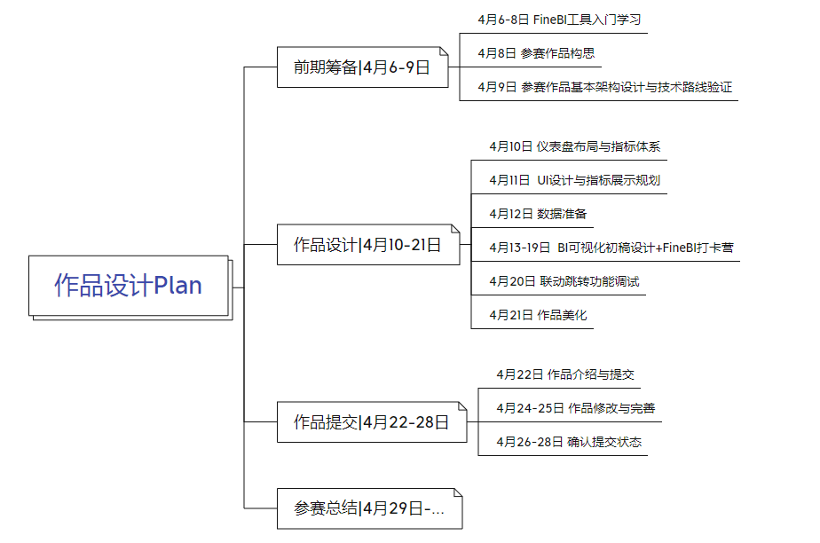

---

### 4.预期成果

- 基于案例公司及所属行业公司的财报数据,使用BI工具构建一个**通用性的多维度、多因子财务质量与效率诊断评估模型,最终形成一套可供企业内、外部人员均可使用的财报诊断分析BI解决方案**。

---

### 5.技术路线

- 第一步:**使用FineBI自助分析场景库设计仪表盘**;
- 第二步:**标准化BI可视化需求数据集**;
- 第三步:编写脚本程序对财报数据因子动态赋值,实时/定期生产BI数据集(含**报表归集库**和**模型评分数据集**);
- 第四步:数据集更新至FineBI场景库,**实现智能化仪表板**；
- 本作品主要侧重于第一步,第二步及第四步中**智能化数据处理与展示功能**。
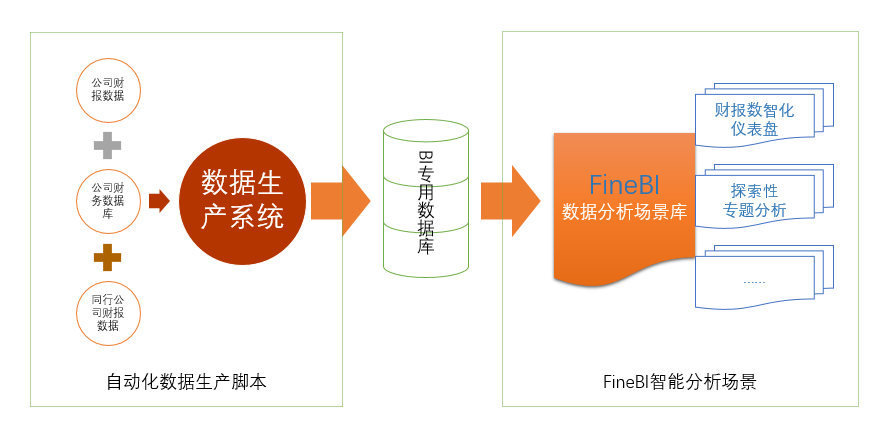

---

### 6 BI解决方案

#### 6.1数据来源(自选数据)

- 本方案BI分析数据系使用**自编脚本程序采集的上市公司公开发布的财报数据**；
- 方案设计原本仅需一个公司及其所属行业相关公司公开数据即可,但考虑到能更好的体现方案对不同使用对象需求及不同使用场景的通用性,本方案拟在玻纤和航运港口行业各选1家公司进行数据采样、BI设计和技术验证。相关数据如下:

|序号|数据源|主要内容|
|--|--|--|
|1|公司财务报告|综合反映企业经营状况|
|2|资产负债表|企业在特定时间节点的所有资产与负债数据|
|3|利润表|反映企业在一定会计期间营业收支与利润状况数据|
|4|现金流量表|经营、投资及融资多方面反映出资产负债表中各个项目对现金流量的影响|
|5|同行公司关键指标数据|用于企业间横向对比分析的相关关键财务指标数据|

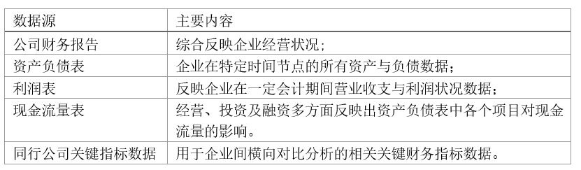

---

#### 6.2分析思路

- 基于财务报表,进行量化建模,基于BI分析与可视化结果,反映公司经营质量与效率状况,发现经营异常数据,具体通过以下思路来实现:
- Step1:**构建多维分析模型(行业对标模型 + 财报能力模型(盈利能力、运营能力、成长能力、偿债能力、现金能力**));
- Step2:基于**各维度子模型构建多因子指标体系**;
- Step3:按**财报日期节点**和**行业维度**,利用BI工具对指标数据进行**纵向/横向分析并**实现可视化;
- Step4:基于BI可视化结果,直观展示对**公司经营质量和效率的评估结论与所发现的经营问题**;
- Step5:**根据诊断结果辅助经营/投资等决策,引导异常问题改进等业务**。
- 财务模型指标体系

|序号|维度|指标体系|
|--|--|--|
|1|**盈利能力模型**|销售净利率，销售毛利率，营收规模，净资产收益率等|
|2|**运营能力模型**|营收与资产关系指标，资产负债比，各类资产周转率等|
|3|**成长能力模型**|营收增长率，资产增长率，利润增长率，收益率增长率等|
|4|**偿债能力模型**|流动比率，速动比率，产权比率，资产负债率等|
|5|**现金能力模型**|经营活动现金净额，投资活动现金净额，筹资活动现金净额，现金价值增加额等|
|6|**行业对标模型**|营收规模，净利规模，利润率，净资产收益率等|

完整的数据模型及分析过程如下图:

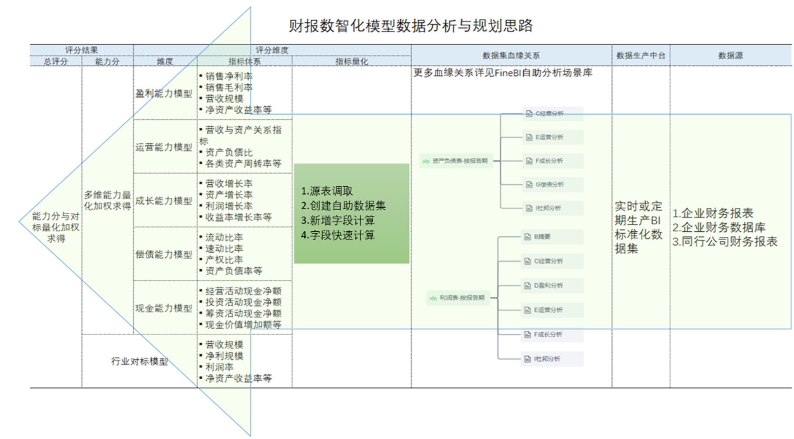

---

#### 6.3 数据处理

- **6.3.1 原始数据归集**

- 所采集原始数据为按每个季度最后一天为节点的统计报表数据,若要进行时间序列和行业对比分析,就需要将数据转换成按**1-行业/2-公司/3-季度/4-会计科目**为不同维度的数据集存盘以备BI连接使用。最主要的基础数据归集方式如下所示:

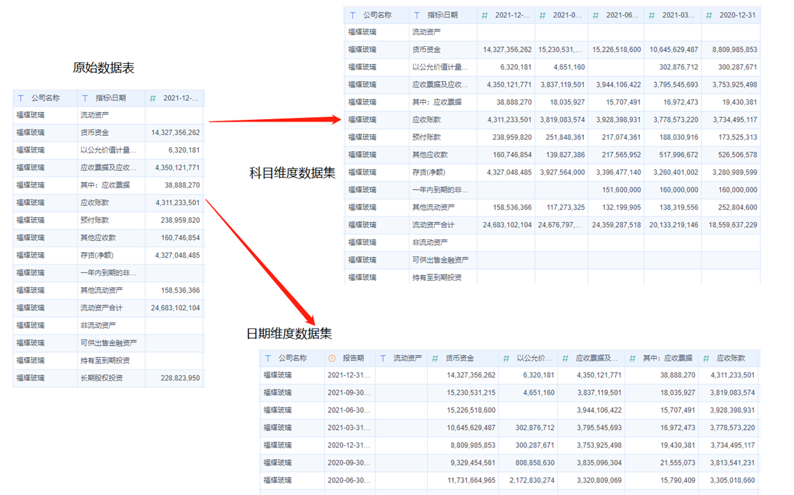
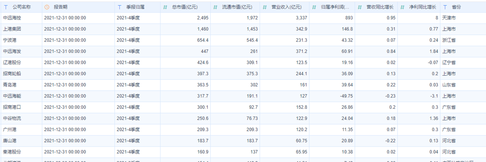

- **6.3.2 BI数据处理**

- 为方便满足智能化的BI可视化设计需要,采取BI自助数据集及字段计算、快速计算功能和自编脚本计算相结合的方式进行数据二次处理:
- **第一种方式是利用BI数据分析环境直接调取,创建自助数据集,字段计算,快速计算和汇总计算等功能处理数据**;
- **第二种方式是通过自编脚本自动处理和存盘。** 对诸如非字段计算类数据、模型加权计算过程类数据进行处理储存,此类涉及模型复杂计算容易增加BI工具的计算负荷,影响BI展示效率,利用自编脚本可提升数据处理和BI展示的效率。
- 为体现模型分析过程,作品中采用创建自助数据集(详见下文自助数据集案例1和案例2)的方式实现部分模型计算,通过行业对标数据与各能力维度总分加权计算得到企业财报诊断总分。
- 通过两种方式结合,仅需要完成BI相对简单的数据更新和抽取操作即可实现报表或报告自动化,同时会大大降低BI工具的运算负荷。

---

- 案例中使用到的部分计算案例如下:
- **自助数据集案例(1)-行业维度评分计算过程**
- **第一步 选择字段**
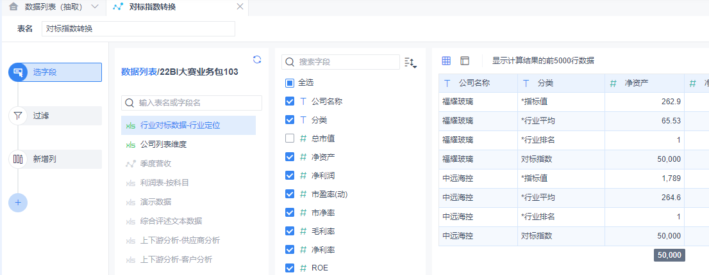

- **第二步 通过过滤保留对标指数**
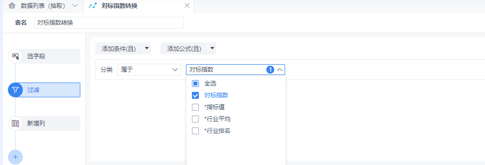

- **第三步 通过新增列方式加权计算对标得分**
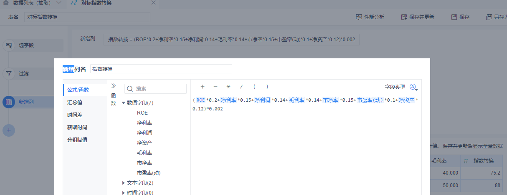

- **第四步 保存自助计算的数据**
`指数转换 = (ROE*0.2 + 净利率*0.15 + 净利润*0.14 + 毛利率*0.14 + 市净率*0.15 + 市盈率(动)*0.1 + 净资产*0.12)*0.002`
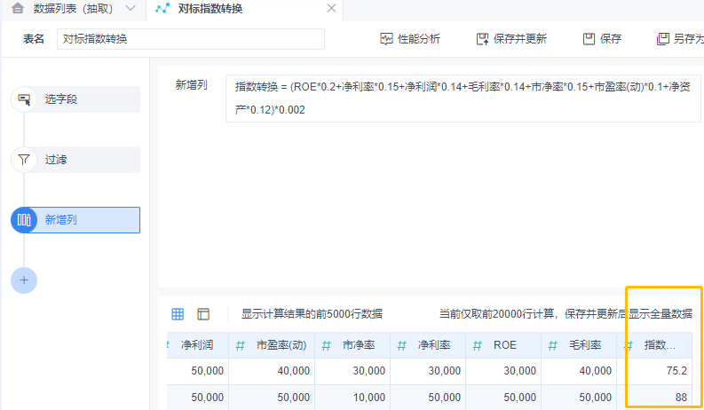

- **第五步 使用自助数据集创建展示组件**
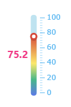

---

- **自助数据集案例(2)-诊断结果评分计算过程**
- **第一步 选择维度综合分**
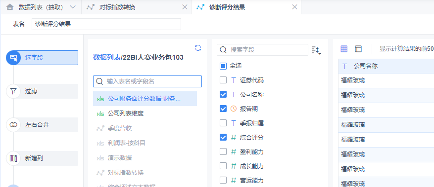

- **第二步 通过过滤保留最近季报的数据**

- **第三步 对案例1中的自助数据集进行左合并**
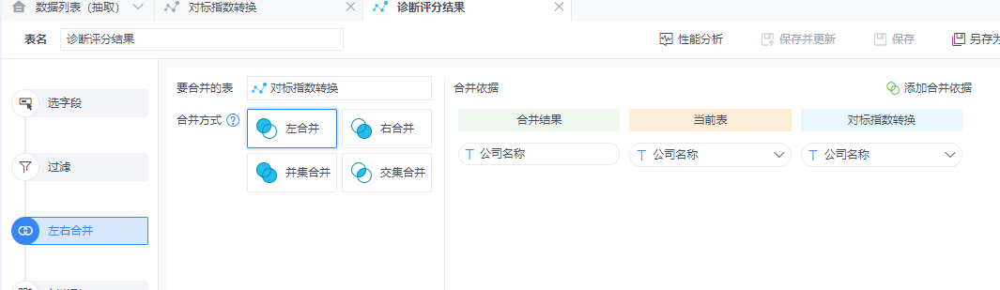

- **第四步 通过维度加权计算综合诊断得分**
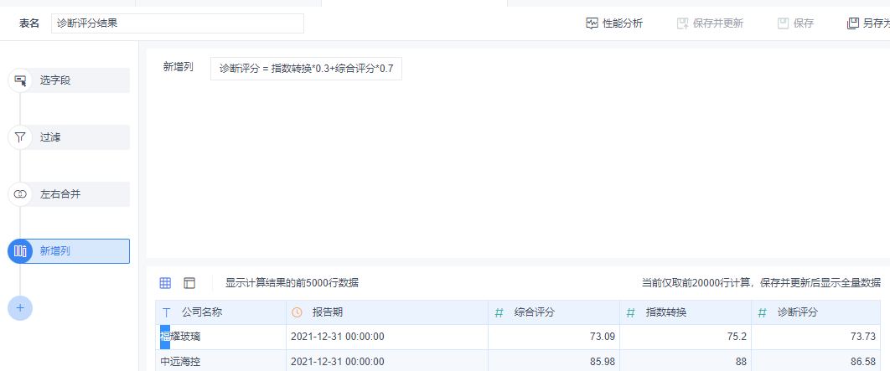

- **第五步 创建综合得分可视化组件**
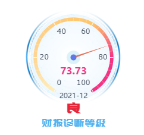

- 字段计算举例
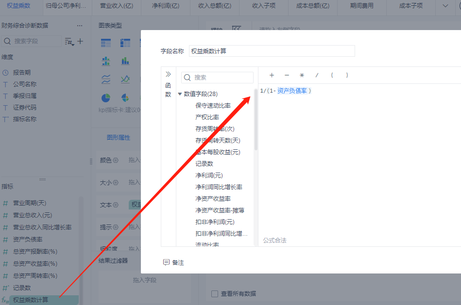
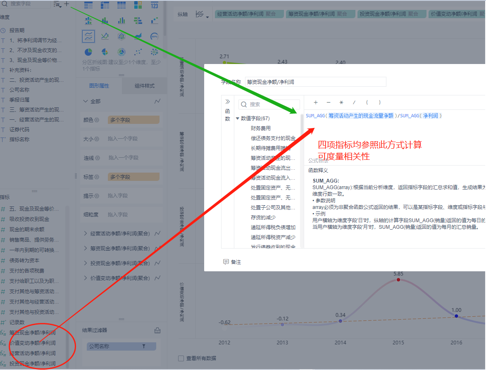

---

- **自助数据集案例(3)-计算每季度所属的营业额**
- **第一步 创建自助数据集,命名"季度营收"**
- 1) 选择字段-"营业总收入"
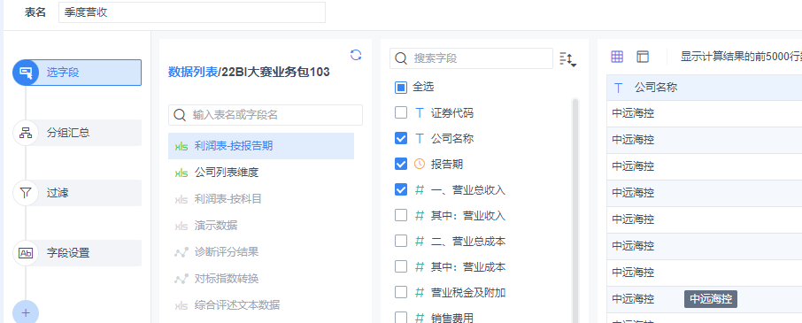

- 2) 分组汇总
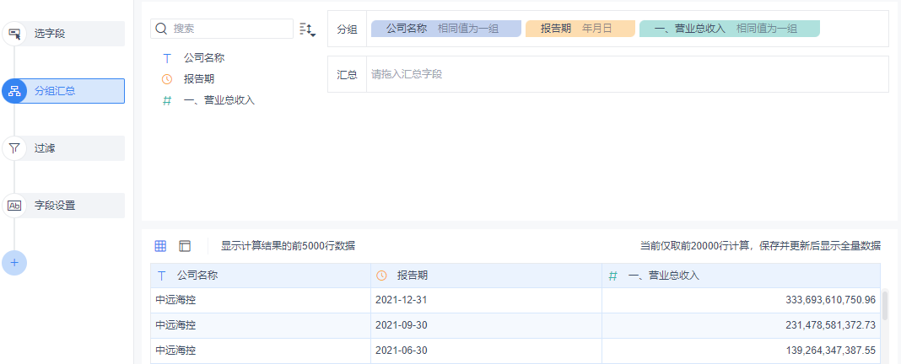

- 3) 过滤保留2021年的数据
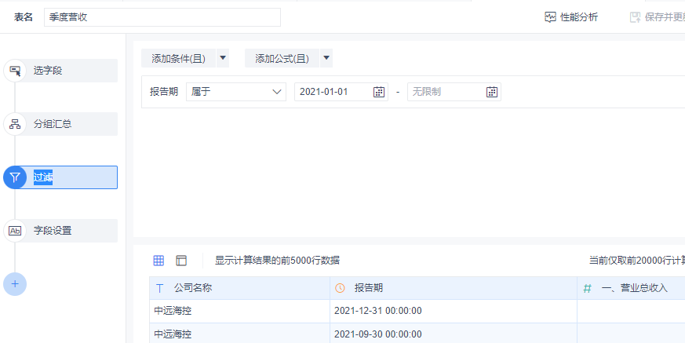

- 4) 格式化各季度累计营收数据
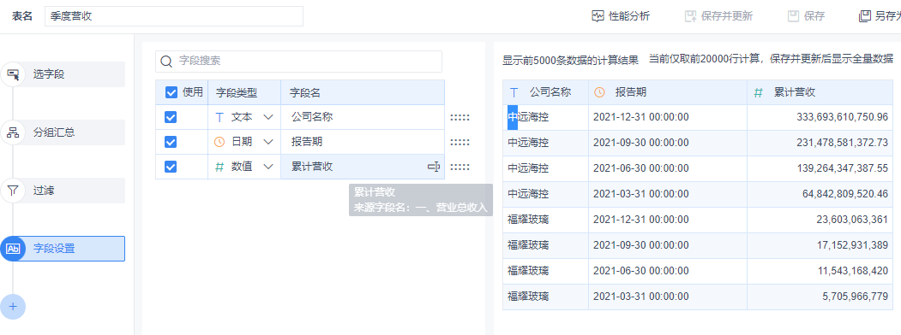

- **第二步**
- 1) 使用函数计算上期末数据

- 2) 通过环比求差的方式计算出各季度净额
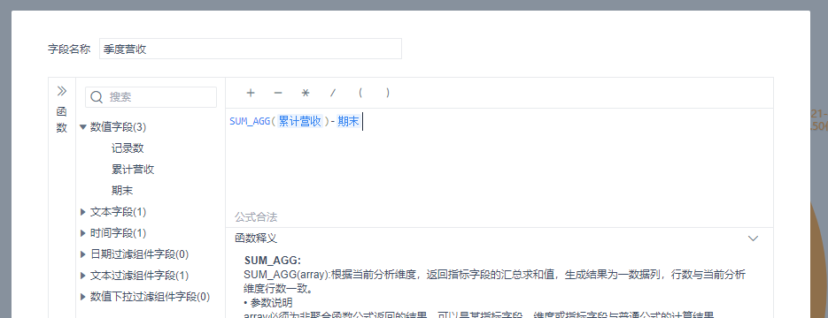

- **第三步 使用数据集创建组件**
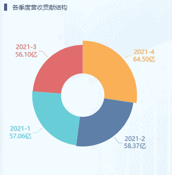

- **第四步 差值计算举例**
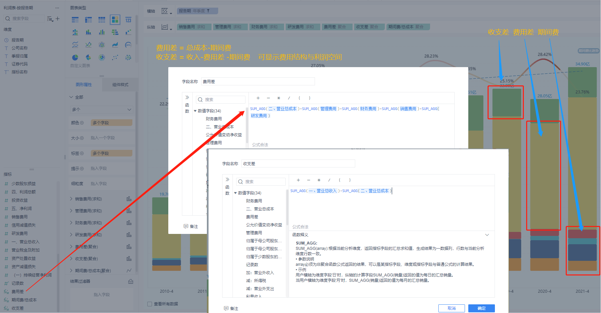

- **第五步 快速计算举例**
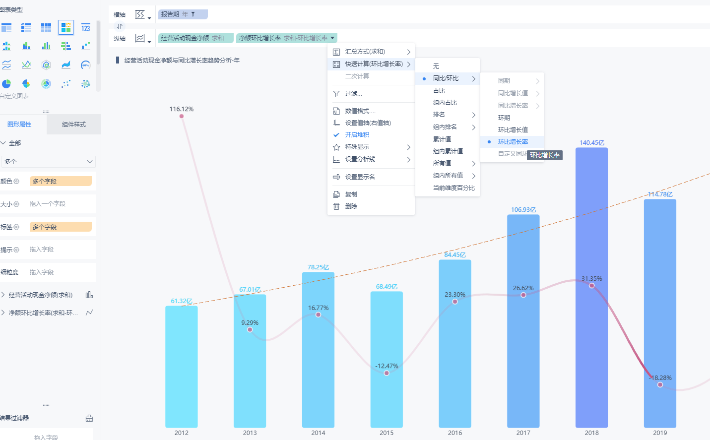

- **第六步 日期维度同比计算案例**
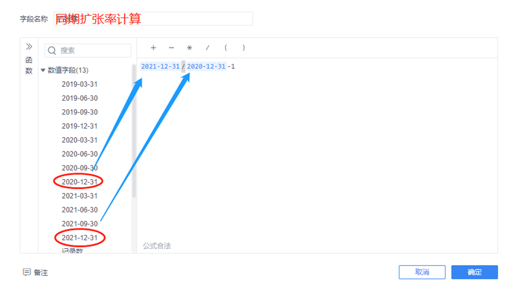

- **6.3.3 BI数据关联**

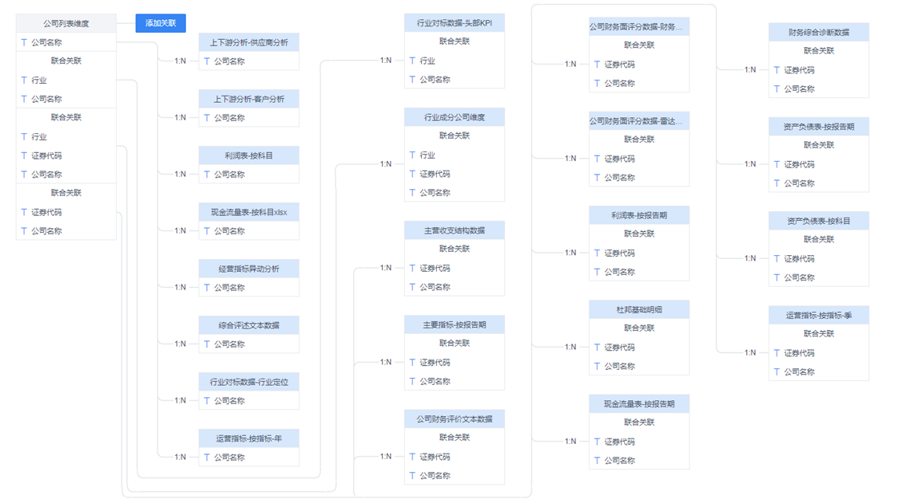

---

#### 6.4 可视化报告

- **6.4.1 可视化框架**

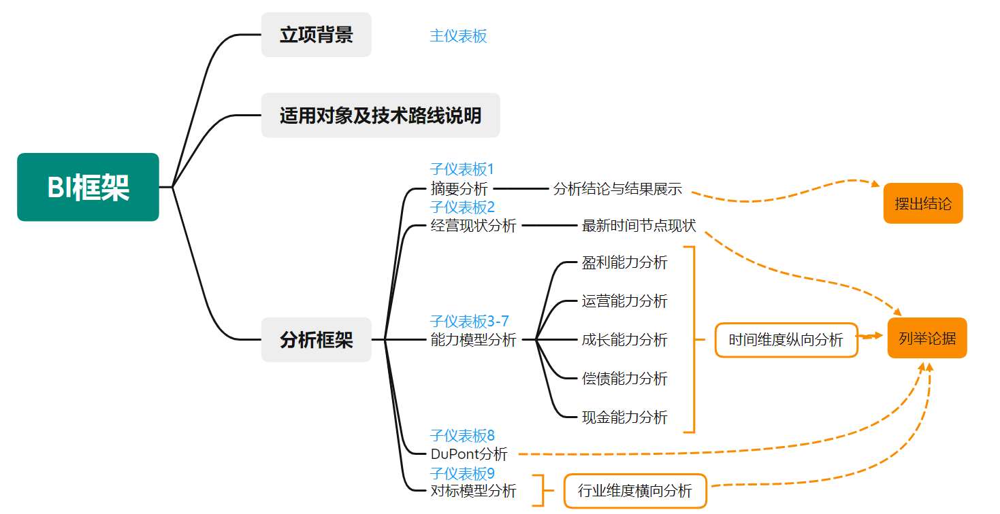

- **6.4.2 组件应用图例**

- FineBI的可视化组件和功能是比较丰富的,基本上可以满足绝大多数应用场景,本方案使用了FineBI中90%以上的基础组件,相关组件应用案例见"附件1-FineBI组件应用案例":
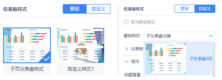

- **6.4.3颜色选择及设置**

- 1.采取自定义样式的方式:
  - 总体色调：浅蓝色+白色;
  - 背景色：使用自定义UI背景图,共享部分为浅蓝色基调,主展示区图表类组件为白底浅蓝色,文本类为白色基调背景;
  - 图表的配色：以红、黄、浅蓝、绿、黑为主色调,搭配相近色,尽可能与总体色调保持协调,并使组件图表显示更清晰直观;
  - 文本:以黑色为主,设置绿色,红色或橙色文本以突出显示,分析类文本统一使用默认显示,标题采用图片分割线做突出,内容使用项目符号区分层次(作品中因考虑到自动化需求,未对内容关键词进行加粗或色调美化等突出效果);
- 2.背景:统一使用带有浅显分割线的半透明浅蓝色为主色调的系统背景或自制UI背景;
- 3.指标卡:使用较为美观的背景图,以突出重点;
- 4.标题:采用简约版的商务性标题;
- 5.展示图表:图表色彩以系统默认为主,对于图表中直接表达原始数据使用实线,柱体,饼图等展示,警戒或回归分析的数据用虚线展示;
- 6.语义强调:配用与数据语义相适应的图形(如:上下箭头,警示图,排序图,强调图)或图表单元格特殊背景,数据条功能等来增强数据语义表达。
- 7.布局分割:采用带分割线的背景图用来区分不同功能区的布局,例如区分结论分析文本区和分析功能区等;
- 8.特别说明:因作品使用了多个公司样本数据,需进行自动化切换非标数据,故选择将结论分析文本储存于数据表中,通过表格组件实现交互。受表格单元格文本自定义功能限制,不能对此类文本进行自定义设计以强调重点语义的效果。

- **6.4.4 布局设计(大图见附件2-布局规划)**
  - 1.首页展示
  - 2.摘要页展示
  - 3.经营分析页展示
  - 4.盈利能力页展示
  - 5.运营能力页展示
  - 6.成长能力页展示
  - 7.偿付能力页展示
  - 8.现金流量页展示
  - 9.杜邦体系分析页展示
  - 10.对标同行业页展示

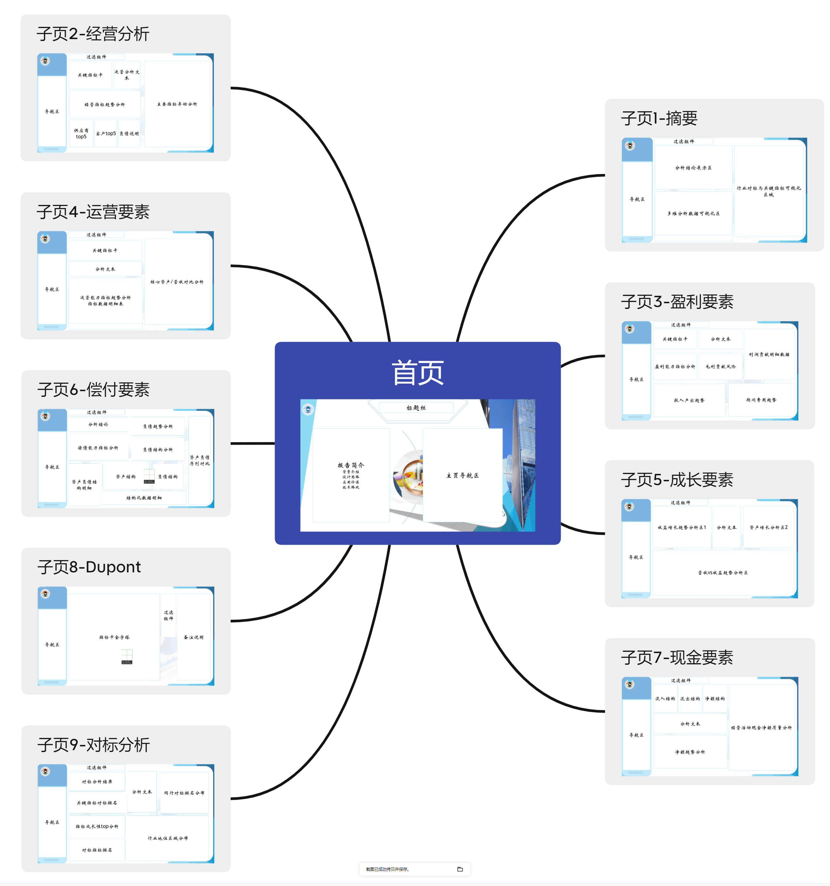

---

- **6.4.5 可视化过程方案**

- **6.4.5.1 封面页/主页----主仪表板**

- 展示效果:
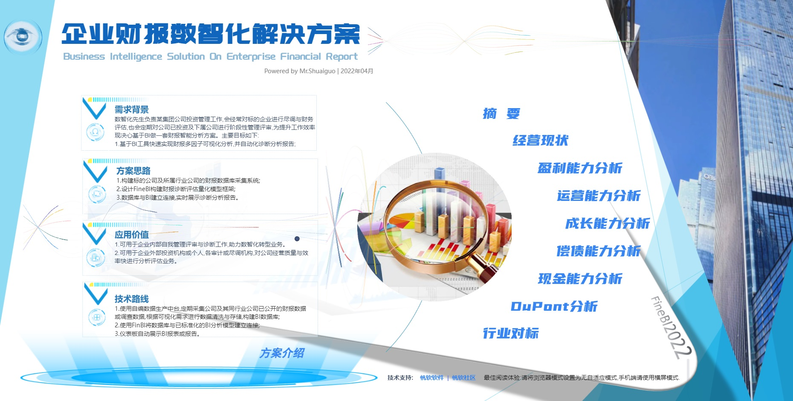

---

- **6.4.5.2摘要专题页**
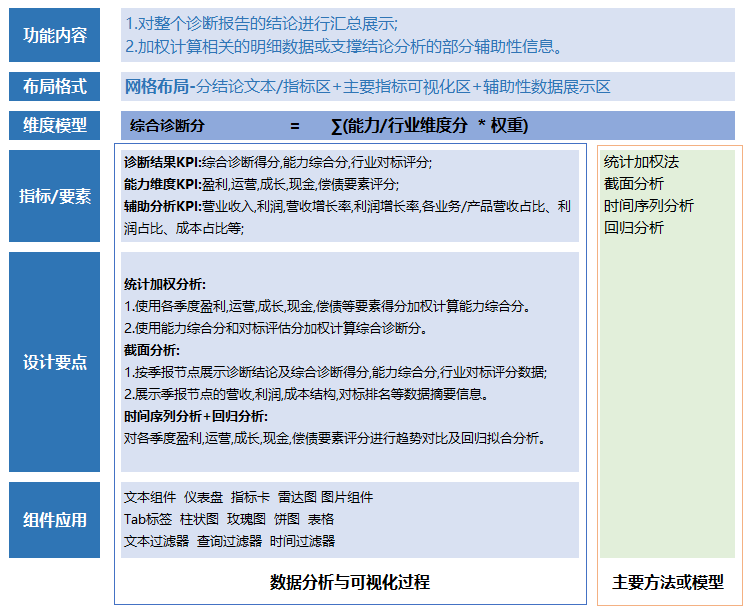

- **功能内容**：
  - 1.对整个诊断报告的结论进行汇总展示；
  - 2.加权计算相关的明细数据或支撑结论分析的部分辅助性信息。
- **布局格式**：
  - 网格布局 - 分结论文本/指标区 + 主要指标可视化区 + 辅助性数据展示区
- **维度模型**：
  - **综合诊断分 = ∑(能力/行业维度分 * 权重)**
- **指标/要素**：
  - **诊断结果KPI**：
    - 综合诊断得分，能力综合分，行业对标评分；
  - **能力维度KPI**：
    - 盈利，运营，成长，现金，偿债要素评分等；
  - **辅助分析KPI**：
    - 营业收入，利润，营收增长率，利润增长率，各业务/产品营收占比，利润占比，成本占比等；
- **设计要点**：
  - **统计加权分析**：
    - 1.使用各季度盈利，运营，成长，现金，偿债等要素得分加权计算能力综合分；
    - 2.使用能力综合分和对标评估分加权计算综合诊断分。
  - **截面分析**：
    - 1.按季报节点展示诊断结论及综合诊断分，能力综合分，行业对标评分数据；
    - 2.展示季报节点的营收，利润，成本结构，对标排名等数据摘要信息。
  - **时间序列分析 + 回归分析**：
    - 对各季度盈利，运营，成长，现金，偿债要素评分进行趋势对比及回归拟合分析。
- **组件应用**：
  - 1.文本组件，仪表盘，指标卡，雷达图，图片组件；
  - 2.Tab标签，柱状图，玫瑰图，饼图，表格；
  - 3.文本过滤器，查询过滤器，时间过滤器。
- **主要方法或模型**
  - 统计加权法
  - 截面分析
  - 时间序列分析
  - 回归分析

- 展示效果：
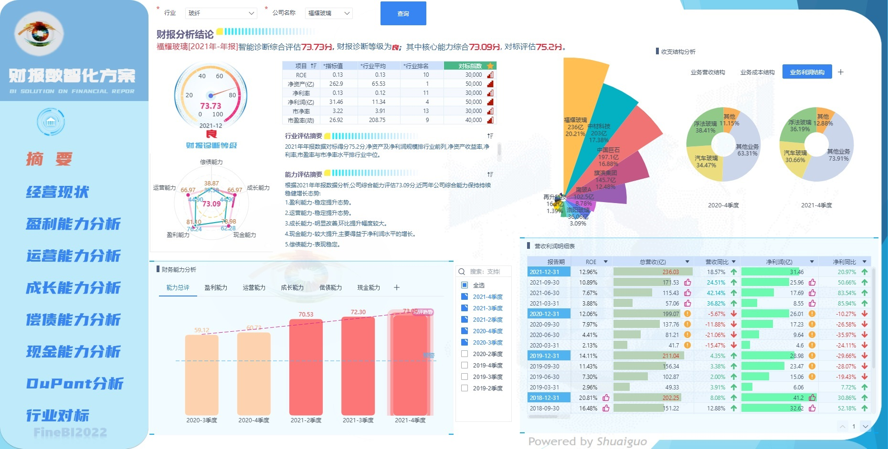

- **组件实践应用说明**:
  - 文本组件:结论分析,摘要文字,专题标题与导航链接设置;
  - 仪表盘+指标卡:诊断得分;
  - 雷达图:盈利,运营,成长,现金,偿债各能力得分及同期对比;
  - Tab标签à能力分析和收支结构分析归类;
  - 柱状图:各季度能力得分时间序列分析,趋势回归分析;
  - 玫瑰图:行业营收排名对比;
  - 饼图:按产品业务类型进行季报节点的营收/成本/利润结构占比分析,与同期实现对比;
  - 表格:展示行业对标及营收利润额/同比增长率明细数据;
  - 文本过滤器/查询过滤器:按行业和公司名进行数据过滤;
  - 时间过滤器:按季度进行时间序列过滤;
  - 图片组件:标题分割线突出显示,返回首页导航链接设置。
- **组件优化:**
  - 指标卡富文本:关键词设置差异化颜色,加粗或特殊字体突出显示;
  - 富文本标题:引入彩色分割图,
  - 仪表盘:设置圆形背景图;
  - 雷达图:对维度评分曲线设置动态效果以突出显示;
  - 表格:采取增长率正负值分别设置绿色上箭头与红色下箭头,营收利润开启数据条,对标指数,表现优异的增长率指标设置专用图表,营收/净利润同比下滑者设置警示图表等方式增强语义表达;
  - 其他:对于坐标轴/图例和标签内容有重复者,优先去掉坐标轴/图例。

---

- **6.4.5.3经营现状分析----子仪表板**
- 设计介绍:
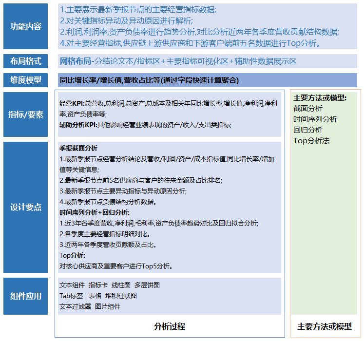

- **功能内容**：
  - 1.主要展示最新季报节点的主要经营指标数据；
  - 2.对关键指标异动及异动原因进行解析；
  - 3.对利润，利润率，资产负债率进行趋势分析，对比分析近两年各季度营收贡献结构数据；
  - 4.对主要经营指标，供应链上游供应商和下游客户端前五名数据进行top分析。
- **布局格式**：
  - 网格布局 - 分结论文本/指标区 + 主要指标可视化区 + 辅助性数据展示区
- **维度模型**：
  - **同比增长率/增长值， 营收占比等(通过字段快速计算聚合)**
- **指标/要素**：
  - **经营KPI**：
    - 总营收，总利润，总资产，总成本及相关年同比增长率，增长值，净利润，净利率，资产负债率等；
  - **辅助分析KPI**：
    - 其他影响经营业绩表现的资产/收入/支出类指标；
- **设计要点**：
  - **季报截面分析**：
    - 1.最新季报节点经营分析结论及营收/利润/资产/成本指标值，同比增长率/增加值等关键信息；
    - 2.最新季报节点前五名供应商与客户的往来金额及占比排名；
    - 3.最新季报节点主要异动指标与异动原因分析；
    - 4.最新季报节点负债结构分析数据。
  - **时间序列分析 + 回归分析**：
    - 1.近3年各季度营收，净利润，毛利率，资产负债率趋势对比及回归拟合分析；
    - 2.各季度主要经营指标明细对比；
    - 3.近两年各季度营收贡献额及占比。
  - TOP分析：
    - 对核心供应商及重要客户进行TOP5分析。
- **组件应用**：
  - 1.文本组件，指标卡，线柱图，多层饼图；
  - 2.Tab标签，表格，堆积柱状图；
  - 3.文本过滤器，图片组件。
- **主要方法或模型**
  - 截面分析
  - 时间序列分析
  - 回归分析
  - TOP分析法

- 展示效果:
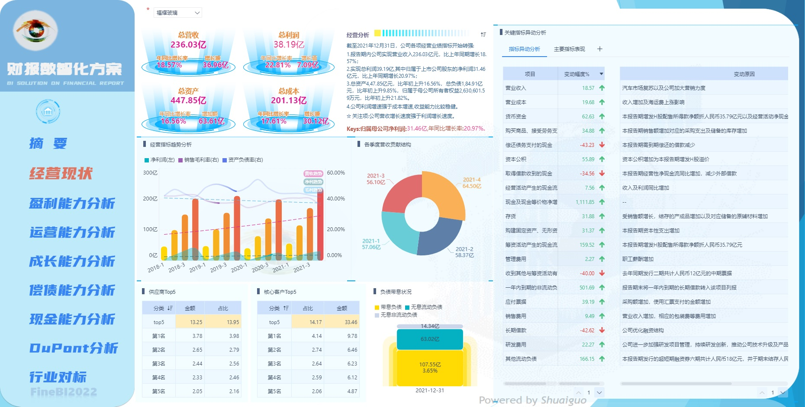

- **组件实践应用说明**:
  - 文本组件:经营现状分析总结,专题标题与导航设置;
  - 指标卡:展示营收/利润/资产/成本总额,同比增长率,同比增长值;
  - 雷达图:盈利,运营,成长,现金,偿债各能力得分及同期对比;
  - Tab标签+表格à对主要指标异动及各季度主要指标表现归类分析;
  - 线柱图:对营收,净利润,毛利率,资产负债率进行时间序列分析,趋势回归拟合;
  - 多层饼图:近两年各季度营收贡献额与占比;
  - 饼图:按产品业务类型进行季报节点的营收/成本/利润结构占比分析,与同期实现对比;
  - 排名表格:前5名供应商/客户往来额,占比排名;
  - 堆积柱状图:负债分类汇总结构分析;
  - 文本过滤器:按公司名进行数据过滤;
  - 图片组件:标题分割线突出显示,返回首页导航链接设置。
- **组件优化**:
  - 指标卡:设置个性背景图;
  - 线柱图:对毛利率,资产负债率曲线设置动态效果以突出显示;
  - 表格:采取增长率正负值分别设置绿色上箭头与红色下箭头,top5排名表小计行设置单元格背景色等方式增强语义表达;
  - 其他:对于坐标轴/图例和标签内容有重复者,优先去掉坐标轴/图例。

---

- **6.4.5.4盈利能力分析----子仪表板**
- 设计介绍:
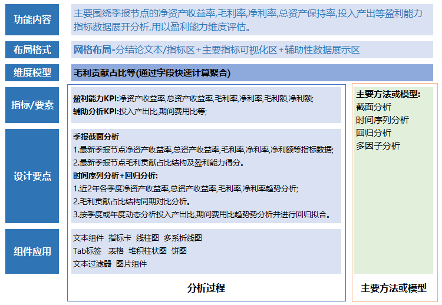

- **功能内容**：
  - 1.主要围绕季报节点的净资产收益率，毛利率，净利率，总资产保持率，投入产出等盈利能力指标数据展开分析，用以盈利能力维度评估。
- **布局格式**：
  - 网格布局 - 分结论文本/指标区 + 主要指标可视化区 + 辅助性数据展示区
- **维度模型**：
  - **毛利贡献占比等(通过字段快速计算聚合)**
- **指标/要素**：
  - **盈利能力KPI**：
    - 净资产收益率，总资产收益率，毛利率，净利率，毛利额，净利额；
  - **辅助分析KPI**：
    - 投入产出比，期间费用比等；
- **设计要点**：
  - **季报截面分析**：
    - 1.最新季报节点净资产收益率，总资产收益率，毛利率，净利率，净利额等指标数据；
    - 2.最新季报节点毛利贡献占比结构及盈利能力得分。
  - **时间序列分析 + 回归分析**：
    - 1.近2年各季度净资产收益率，总资产收益率，毛利率，净利率趋势分析；
    - 2.毛利贡献占比结构同期对比分析；
    - 3.按季度或年度动态分析投入产出比，期间费用比趋势分析并进行回归拟合。
- **组件应用**：
  - 1.文本组件，指标卡，线柱图，多系折线图；
  - 2.Tab标签，表格，堆积柱状图，饼图；
  - 3.文本过滤器，图片组件。
- **主要方法或模型**
  - 截面分析
  - 时间序列分析
  - 回归分析
  - 多因子分析

- 展示效果：
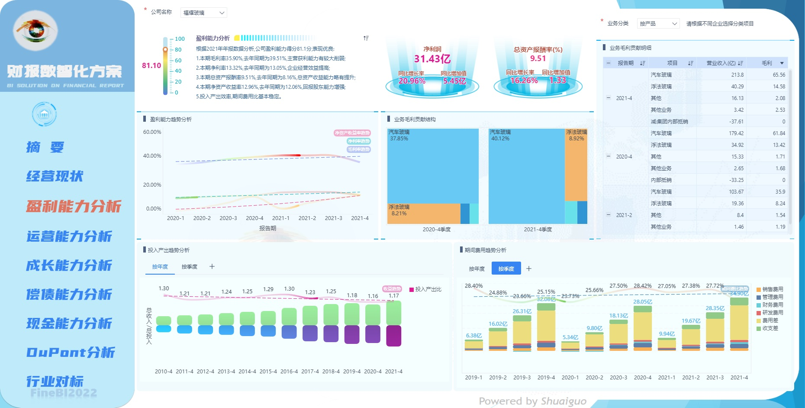

- **组件实践应用说明**:
  - 文本组件:盈利能力维度分析总结,专题标题与导航设置,组件提示;
  - 指标卡:展示运营能力维度得分,净利润,净资产收益率截面分析数据;
  - 多系折线图:净资产收益率,总资产收益率,净利率,资产报酬率等盈利能力指标趋势分析,反映盈利能力的动态变化;
  - Tab标签+线柱图à对投入产出比,期间费用比按年/季度归类分析,趋势回归拟合;
  - 线柱图:对营收,净利润,毛利率,资产负债率进行时间序列分析;
  - 饼图+表格:按产品业务类型进行季报节点毛利贡献结构占比分析,与同期实现对比;
  - 文本过滤器:按公司名进行数据过滤;
  - 图片组件:标题分割线突出显示,返回首页导航链接设置。
- **组件优化**:
  - 指标卡:设置个性背景图,富文本彩色数字突出显示;
  - 线柱图:对投入产出比,期间费用比趋势曲线设置动态效果以突出显示;
  - 表格:对毛利贡献占比较高的设置点赞图表,贡献较低者设置警示图表以区分语义表达;
  - 其他:对于坐标轴/图例和标签内容有重复者,优先去掉坐标轴/图例。

---

- **6.4.5.5运营能力分析----子仪表板**
- 设计介绍:
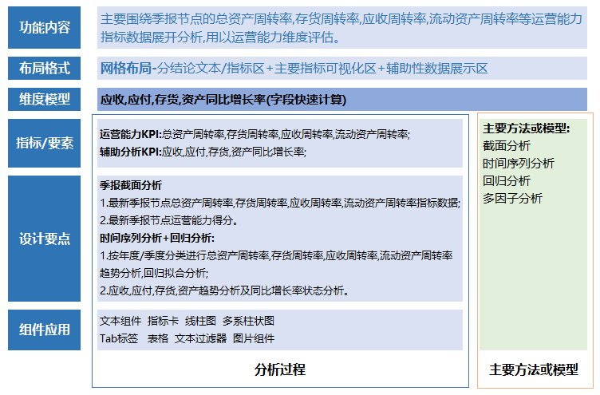

- **功能内容**：
  - 1.主要围绕季报节点的总资产周转率，存货周转率，应收周转率，流动资产周转率等运营能力指标数据展开分析，用以运营能力维度评估。
- **布局格式**：
  - 网格布局 - 分结论文本/指标区 + 主要指标可视化区 + 辅助性数据展示区
- **维度模型**：
  - **应收，应付，存货，资产同比增长率(字段快速计算)**
- **指标/要素**：
  - **运营能力KPI**：
    - 总资产周转率，存货周转率，应收周转率，流动资产周转率；
  - **辅助分析KPI**：
    - 应收，应付，存货，资产同比增长率；
- **设计要点**：
  - **季报截面分析**：
    - 1.最新季报节点总资产周转率，存货周转率，营收周转率，流动资产周转率指标数据；
    - 2.最新季报节点运营能力得分。
  - **时间序列分析 + 回归分析**：
    - 1.按年度/季度分类进行总资产周转率，存货周转率，流动资产周转率趋势分析，回归拟合分析；
    - 2.应收，应付，存货，资产趋势分析及同比增长率状态分析。
- **组件应用**：
  - 1.文本组件，指标卡，线柱图，多系折线图；
  - 2.Tab标签，表格，文本过滤器，图片组件。
- **主要方法或模型**
  - 截面分析
  - 时间序列分析
  - 回归分析
  - 多因子分析

- 展示效果：
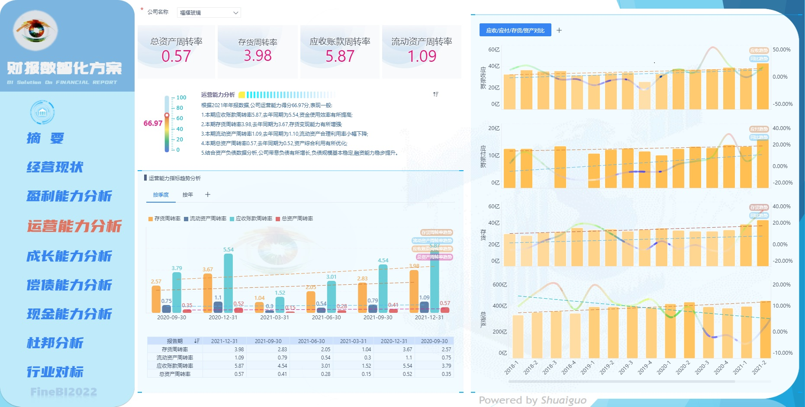

- **组件实践应用说明**:
  - 文本组件:运营能力维度分析总结,专题标题与导航设置;
  - 指标卡:展示运营能力关键指标截面数据:总资产周转率,存货周转率,应收款周转率,流动资产周转率,运营能力得分;
  - Tab标签+多系列柱形图+表格à对总资产周转率,存货周转率,应收款周转率,流动资产周转率按年度/季度分类做趋势回归拟合,使用表格展示各季度指标数据明细,直接评估运营质量和效率;
  - 线柱图:对应收,应付,存货,资产与净利润进行序列分析,回归拟合并做横向对比,用于对运营质量的辅助评估;
  - 文本过滤器:按公司名进行数据过滤;
  - 图片组件:标题分割线突出显示。
- **组件优化**:
  - 指标卡:设置个性背景图,富文本彩色数字突出显示;
  - 线柱图:对增长率势曲线设置动态效果以突出显示,使用区间渐变色调表达增长率速度高低水平;
  - 其他:对于坐标轴/图例和标签内容有重复者,优先去掉坐标轴/图例。

---

- **6.4.5.6成长能力分析----子仪表板**
- 设计介绍:
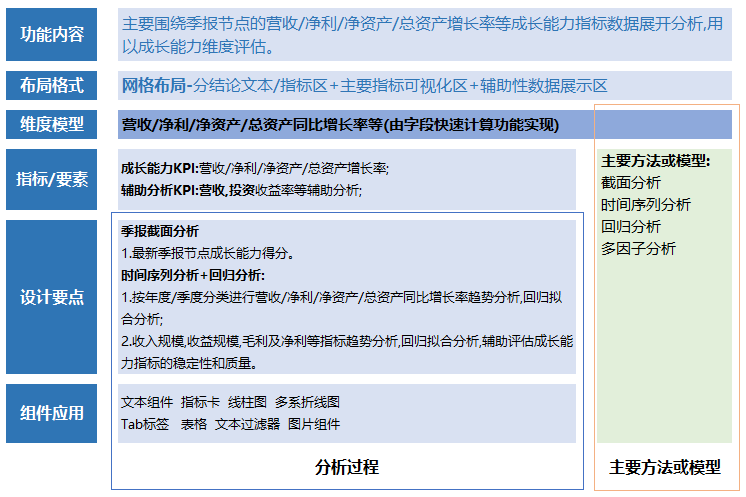

- **功能内容**：
  - 1.主要围绕季报节点的营收/净利/净资产/总资产增长率等成长能力指标数据展开分析，用以成长能力维度评估。
- **布局格式**：
  - 网格布局 - 分结论文本/指标区 + 主要指标可视化区 + 辅助性数据展示区
- **维度模型**：
  - **营收/净利/净资产/总资产同比增长率等(由字段快速计算功能实现)**
- **指标/要素**：
  - **成长能力KPI**：
    - 营收/净利/净资产/总资产增长率；
  - **辅助分析KPI**：
    - 营收，投资收益率等辅助性分析；
- **设计要点**：
  - **季报截面分析**：
    - 1.最新季报节点成长能力得分；
  - **时间序列分析 + 回归分析**：
    - 1.按年度/季度分类进行营收/净利/净资产/总资产同比增长率趋势分析，回归拟合分析；
    - 2.收入规模，收益规模，毛利及净利等指标趋势分析，回归拟合分析，辅助评估成长能力指标的稳定性和质量。
- **组件应用**：
  - 1.文本组件，指标卡，线柱图，多系折线图；
  - 2.Tab标签，表格，文本过滤器，图片组件。
- **主要方法或模型**
  - 截面分析
  - 时间序列分析
  - 回归分析
  - 多因子分析

- 展示效果：

- **组件实践应用说明**:
  - 文本组件:成长能力维度分析总结,专题标题与导航设置;
  - 指标卡:展示运营能力得分;
  - Tab组件+线柱图+表格:按季度或年度分类展示成长能力关键指标时间序列趋势及回归拟合线:营收同比增长率,净利同比增长率,净资产增长率,总资产增长率;使用表格展示截面明细数据;
  - Tab组件+多系列线柱图à对营收,利润等成长基础类指标按年度/季度分类做趋势回归拟合;
  - 文本过滤器:按公司名进行数据过滤;
  - 图片组件:标题分割线突出显示。
- **组件优化**:
  - 指标卡:设置渐变色调标尺,富文本彩色数字突出显示;
  - 线柱图:对增长率趋势曲线设置动态效果以突出显示,使用区间渐变色调表达增长率速度高低水平;
  - 其他:对于坐标轴/图例和标签内容有重复者,优先去掉坐标轴/图例。

---

- **6.4.5.7偿债能力分析----子仪表板**
- 设计介绍:
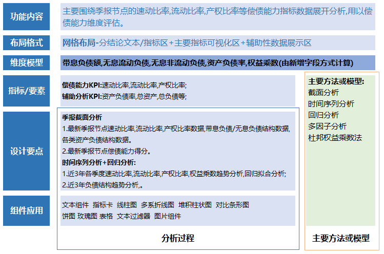

- **功能内容**：
  - 1.主要围绕季报节点的速动比率，流动比率，产权比率等偿债能力指标数据展开分析，用以偿债能力维度评估。
- **布局格式**：
  - 网格布局 - 分结论文本/指标区 + 主要指标可视化区 + 辅助性数据展示区
- **维度模型**：
  - **带息负债额，无息流动负债，无息非流动负债，资产负债率，权益乘数(由新增字段方式实现)**
- **指标/要素**：
  - **偿债能力KPI**：
    - 速动比率，流动比率，产权比率；
  - **辅助分析KPI**：
    - 资产负债率，总资产，总负债等；
- **设计要点**：
  - **季报截面分析**：
    - 1.最新季报节点速动比率，流动比率，产权比率数据，带息负债/无息负债结构数据，各类资产负债结构数据；
    - 2.最新季报节点偿债能力得分。
  - **时间序列分析 + 回归分析**：
    - 1.近3年各季度速动比率，流动比率，产权比率，权益乘数趋势分析，回归拟合分析；
    - 2.近3年负债结构趋势分析。
- **组件应用**：
  - 1.文本组件，指标卡，线柱图，多系折线图，堆积柱状图，对比条形图；
  - 2.饼图，玫瑰图，表格，文本过滤器，图片组件。
- **主要方法或模型**
  - 截面分析
  - 时间序列分析
  - 回归分析
  - 多因子分析
  - 杜邦权益乘数法

- 展示效果：
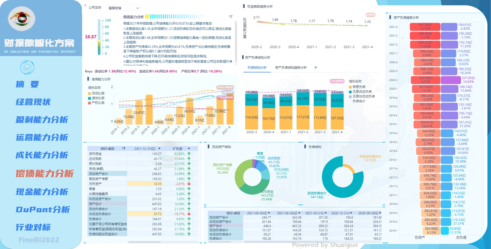

- **组件实践应用说明**:
  - 文本组件:偿债能力维度分析总结,专题标题与导航设置;
  - 指标卡:展示偿债能力得分及偿债能力关键指标截面数据:速动比率,流动比率,产权比率;
  - 线柱图:展示偿债能力关键指标与净利润时间序列对比分析趋势和回归拟合线:速动比率,流动比率,产权比率;
  - 表格+饼图:展示资产负债结构数据截面明细数据;
  - 堆积柱形图:对带息/无息负债结构数据进行趋势分析;
  - 对比条形图:总资产和总负债总额及环比增长率进行展示;
  - 多系列折线图à对资产负债率,流动负债占比,流动资产占比分类做趋势回归拟合;
  - 文本过滤器:按公司名进行数据过滤;
  - 图片组件:标题分割线突出显示。
- **组件优化**:
  - 指标卡:设置渐变色调标尺,富文本彩色数字突出显示;
  - 线柱图/条形图:对部分增长率趋势曲线设置动态效果以突出显示,使用区间渐变色调表达增长率速度高低水平;
  - 表格:通过对最新一季的扩张率正负值设置彩色箭头图,对扩张率负值对应的字段单元格设置黄色背景的方式突出显示;
  - 饼图:去边框设计;
  - 其他:对于坐标轴/图例和标签内容有重复者,优先去掉坐标轴/图例,部分组件采用设置带分割线的背景图来区分整体布局的使用性质。

---

- **6.4.5.8现金能力分析----子仪表板**
- 设计介绍:
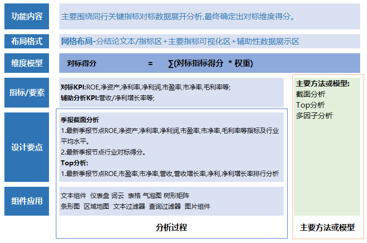

- **功能内容**：
  - 1.主要围绕同行关键指标对标数据展开分析，最终确定出对标维度得分。
- **布局格式**：
  - 网格布局 - 分结论文本/指标区 + 主要指标可视化区 + 辅助性数据展示区
- **维度模型**：
  - **对标得分 = ∑(对标指标得分 * 权重)**
- **指标/要素**：
  - **对标KPI**：
    - ROE，净资产，净利率，净利润，市盈率，毛利率等；
  - **辅助分析KPI**：
    - 营收/净利增长率等；
- **设计要点**：
  - **季报截面分析**：
    - 1.最新季报节点ROE，净利率，净利润，市盈率，市净率，毛利率等指标及行业平均水平；
    - 2.最新季报节点行业对标得分。
  - **TOP分析**：
    - 1.最新季报节点ROE，市盈率，市净率，营收，营收增长率，净利，净利增长率排行分析。
- **组件应用**：
  - 1.文本组件，仪表盘，词云，表格，气泡图，树形矩阵
  - 2.条形图，区域地图，文本过滤器，查询过滤器，图片组件。
- **主要方法或模型**
  - 截面分析
  - 回归分析
  - 多因子分析

- 展示效果：
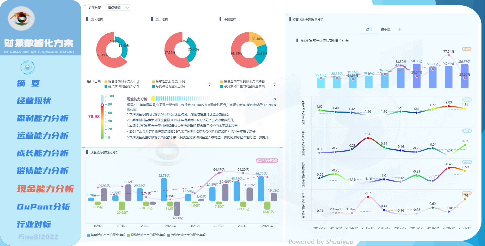

- **组件实践应用说明**:
  - 文本组件:现金能力维度分析总结,专题标题与导航设置;
  - 指标卡+玫瑰图:展示现金能力得分及现金能力关键指标截面数据:经营/投资/筹资活动产生的现金流入/流出/净额结构数据;
  - 多系列线柱图:展示现金能力关键指标趋势和回归拟合线:经营/投资/筹资活动产生的现金净额;
  - Tab组件+线柱图:按年度/季度分类对经营活动产生的现金金额做趋势回归分析;
  - 分区折线图::经营/投资/筹资活动产生的现金净额及价值变动净额分别与净利润比值做趋势分析;
  - 文本过滤器:按公司名进行数据过滤;
  - 图片组件:标题分割线突出显示。
- **组件优化**:
  - 指标卡:设置渐变色调标尺,富文本彩色数字突出显示;
  - 线柱图/折线图:对部分增长率趋势曲线设置动态效果以突出显示,使用区间渐变色调表达增长率速度高低水平;
  - 表格:通过对最新一季的扩张率正负值设置彩色箭头图,对扩张率负值对应的字段单元格设置黄色背景的方式突出显示;
  - 玫瑰图:去边框设计;
  - 其他:对于坐标轴/图例和标签内容有重复者,优先去掉坐标轴/图例,部分组件采用设置带分割线的背景图来区分整体布局的使用性质。

---

- **6.4.5.9杜邦体系分析----子仪表板**
- 设计介绍:
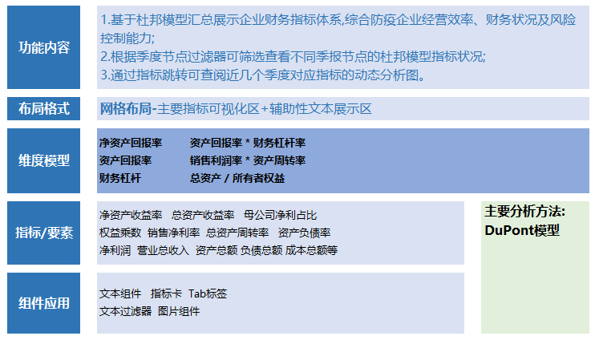

- **功能内容**：
  - 1.基于杜邦模型汇总展示企业财务指标体系，综合防疫企业经营效率、财务状况及风险控制能力；
  - 2.根据季报节点过滤器可筛选查看不同季报节点的杜邦模型指标状况；
  - 3.通过指标跳转可查阅几个季度对应指标的动态分析图。
- **布局格式**：
  - 网格布局 - 分结论文本/指标区 + 主要指标可视化区 + 辅助性数据展示区
- **维度模型**：
  - **净资产回报率，资产回报率 * 财务杠杆率，资产回报率，销售利润率 * 资产周转率，财务杠杆，总资产/所有者权益**
- **指标/要素**：
  - **杜邦体系分析系统**：
    - 净资产收益率，总资产收益率，母公司净利占比，权益乘数，销售净利率，总资产周转率，资产负债率，净利润，营业总收入，资产总额，成本总额等；
- **组件应用**：
  - 1.文本组件，指标卡，tab标签
  - 2.文本过滤器，图片组件
- **主要方法或模型**
  - 杜邦分析体系模型

- 展示效果：
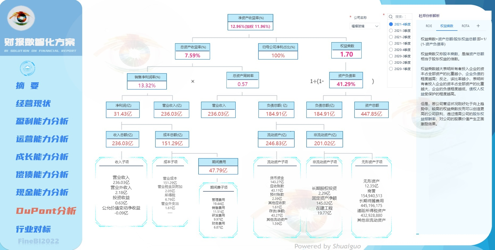
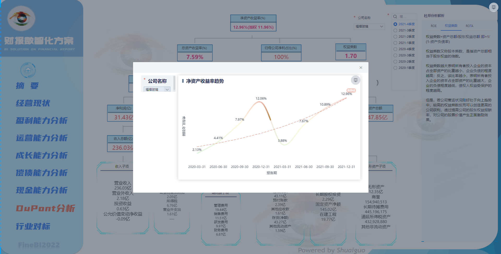

- **组件实践应用说明**:
  - Tab组件+文本组件:归类展示杜邦模型原理解析内容;
  - 指标卡:分类展示具体季报节点的指标名及指标值;
  - 过滤器:指定所要查看数据的公司和季报周期;
  - 折线图:通过对指标设置跳转功能,跳转显示多季度指标趋势分析。

---

- **6.4.5.10行业对标分析----子仪表板**
- 设计介绍:
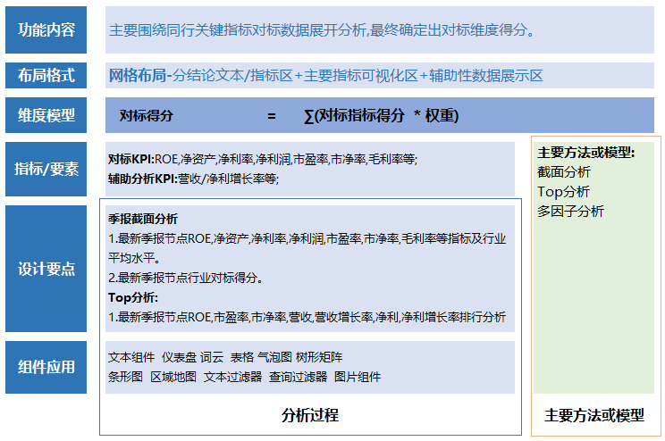

- **功能内容**：
  - 1.主要围绕同行关键指标对标数据展开分析，最终确定出对标维度得分。
- **布局格式**：
  - 网格布局 - 分结论文本/指标区 + 主要指标可视化区 + 辅助性数据展示区
- **维度模型**：
  - **对标得分 = ∑(对标指标得分 * 权重)**
- **指标/要素**：
  - **对标KPI**：
    - ROE，净资产，净利率，净利润，市盈率，毛利率等；
  - **辅助分析KPI**：
    - 营收/净利增长率等；
- **设计要点**：
  - **季报截面分析**：
    - 1.最新季报节点ROE，净利率，净利润，市盈率，市净率，毛利率等指标及行业平均水平；
    - 2.最新季报节点行业对标得分。
  - **TOP分析**：
    - 1.最新季报节点ROE，市盈率，市净率，营收，营收增长率，净利，净利增长率排行分析。
- **组件应用**：
  - 1.文本组件，仪表盘，词云，表格，气泡图，树形矩阵
  - 2.条形图，区域地图，文本过滤器，查询过滤器，图片组件。
- **主要方法或模型**
  - 截面分析
  - 回归分析
  - 多因子分析

- 展示效果：
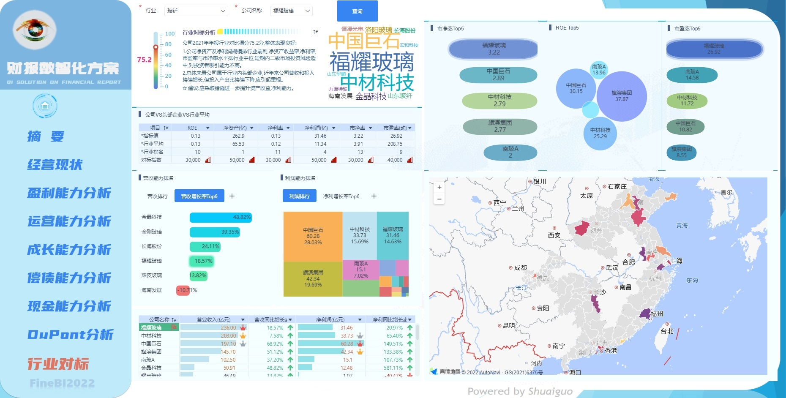

- **组件实践应用说明**:
  - 文本组件:行业对标维度分析总结,专题标题与导航设置;
  - 指标卡:展示行业对标维度得分截面数据;
  - 词云:映射企业所属行业的竞争对手有哪些,并提现营收规模大小;
  - 表格:展示对标结果及同行营收,利润等截面数据明细:ROE,净资产,净利率,净利润,市盈率,市净率,毛利率等;
  - 气泡图,条形图,树形矩阵,柱状图:最新季报节点ROE,市盈率,市净率,营收,营收增长率,净利,净利增长率排行分析;
  - 区域地图:展示行业产业地图,显示相关公司所属省份,按营收规模突出所属城市;
  - 文本过滤器,查询过滤器:按公司名,行业进行数据过滤;
  - 图片组件:标题分割线突出显示。
- **组件优化**:
  - 指标卡:设置渐变色调标尺,富文本彩色数字突出显示;
  - 条形图/柱状图:对排行分钟图形中目标公司设置动态效果以突出显示;
  - 表格:采取增长率正负值分别设置绿色上箭头与红色下箭头,营收利润开启数据条,营收/利润前三设置专用图形等方式增强语义表达;
  - 其他:对于坐标轴/图例和标签内容有重复者,优先去掉坐标轴/图例,部分组件采用设置带分割线的背景图来区分整体布局的使用性质。

---

### 7.设计亮点

#### 7.1 模块化

- 将子专题分析模块化,通过仪表盘联动和超链接功能实现总仪表盘和子仪表盘的无缝链接,为专题设计和拓展提供良好支持,大幅降低维护和拓展
- 数据生产与数据使用相分离,提升数据安全与BI工具运行效率。

#### 7.2 自动化

- 通过与可视化模块数据集相匹配的自动化数据生产脚本搭配,使得很多需要几天甚至几周才能完成的报表分析业务的工作效率提升到几分钟就完成巨大进步;

#### 7.3 标准化

- 本方案实现对财报数据分析的标准化,可大幅降低需求人员的工作量,提升业务效率和品质;

#### 7.4 多主体

- 方案适用于任何单个或多个公司,包括集团公司,其他多主体联合体;

#### 7.5 多对象

- 方案可满足企业内外不同人员的需求,如内部管理人员,财务人员,外部投资人,审计或尽调人员,数据分析专业人员等;

#### 7.6 多拓展

- 数据专业人员还可以随意在此基础上实现更多专题性分析功能的拓展,比如增加预算管理,OKR,财务基础分析等功能,即可实现相对完整的财务数智化方案。

---

### 8.推广价值

#### 8.1方案实效

- 方案可协助财报分析业务/审计业务/投资评估/尽调业务智能化,为使用者创造两方面直接价值:
  - <1> 决策支撑价值----快速得出企业经营质量评估结论,提供及时的决策支持
    - 客观的反映企业经营质量与效率,展示指标状态与数据异常;
    - 通过数据对比分析发现企业业务问题;
    - 可反映企业优势和劣势;
    - 明确企业行业定位和制定阶段性发展目标。
  - <2> 工作效率价值
    - 降低人工成本     N人    ==>      0.n人
    - 工作效率提升    1-2周    ==>     <1小时

#### 8.2推广意义

- 每个企业都离不开财务业务,财报数智化已引起几乎所有企业的重视!方案可在任意企业及投资/审计/尽调专业人员业务中推广,可大幅提升相关业务资源投入,提升业务效率:
- 使用BI自助分析业务,突破传统ERP的局限性和成本限制,大大降低中小企业和个人转型数智化业务门槛;
- 方案适合任何企业或个人直接套用,快速实现财务报表智能化分析。
- 搞可拓展性,任何使用者都可在此基础上根据需要拓展OKR,预算管理,基础报表及其他专题性探索分析模块,快速构建完整的企业内部财务数智化解决方案。
- 为各类专业人员(投资、审计及尽调等)提供了智能化效率工具,大幅提升自助分析工作效率。

---

## 三、参赛总结

### 1.FineBI功能

- 市面上BI产品很多,本次参赛,是本人第一次与FineBI的亲密接触,发现FineBI有很多实用性很强的功能,下面列举部分在方案应用中的亮点功能:
  - **组件复用**:极大降低重复性工作负荷,对提升设计效率具有积极作用;
  - **公共链接加密分享**:便于分析结果实现相对安全的多终端,多人员的结果共享和交互;大大降低沟通和共享硬件成本;
  - **组件互动**：灵活的超连接,可大幅提升仪表盘和组件的互动性和联动性;
  - **自定义动画**:可以通过对突出对象进行动画设置,如对时间序列数据曲线设置动画后,可动态显示曲线变化趋势;
  - **自助数据分析**:FineBI分组汇总性能很强悍,数据处理计算比Exce快很多;
  - **目录管理**:非常适合非IT人员构建数据管理中台;
  - **自动关联功能**:能够实现多表自动关联和跨组件自动联动,使得数据连接极简化;并使得模块化设计随心所欲,无限拓展。
  - **自定义指标卡**:可突出展示KPI信息,也可以结合计算数据进行富文本加工。
  - **Excel友好度**:Finebi对Exce的兼容性很高,适合无IT技能储备的初学者学习和使用;
  - **文档培训**:文档功能案例丰富,介绍详细,课程服务比较细致。
- 当然,在使用过程中也有几个需求无法实现,比如过滤组件的跨仪表盘联动,指标卡文本不能自动换行,过滤条件与Tab组件标题共享,以及转置表基础上进行图表绘制,Js脚本兼容等功能,希望FineBI后期能够继续迭代升级,打造功能更加强大的国产BI。

### 2.总结

- 利用较短的时间学会了FineBI的操作功能,并通过帆软FCRA及FCBA工程师认证,进一步提升了自己快速学习,发现问题,解决问题的能力;通过大赛作品设计与制作,快速掌握了FineBI自助分析的全流程能力;通过使用业余时间边学边设计作品,压力太大;好在通过合理安排计划和时间,同时在大赛组织人员、打卡营讲师和技术支持人员的帮助下,顺利完成了学习和作品开发。借此特别感谢帆软为数据爱好者创造的交流学习的机会,也感谢大赛组织人员,讲师,技术支持人员的分享和支持,也要感谢后期评审人员及组织人员的辛勤付出。

---

## 四、附件

- **1.主仪表板-封面页/首页**
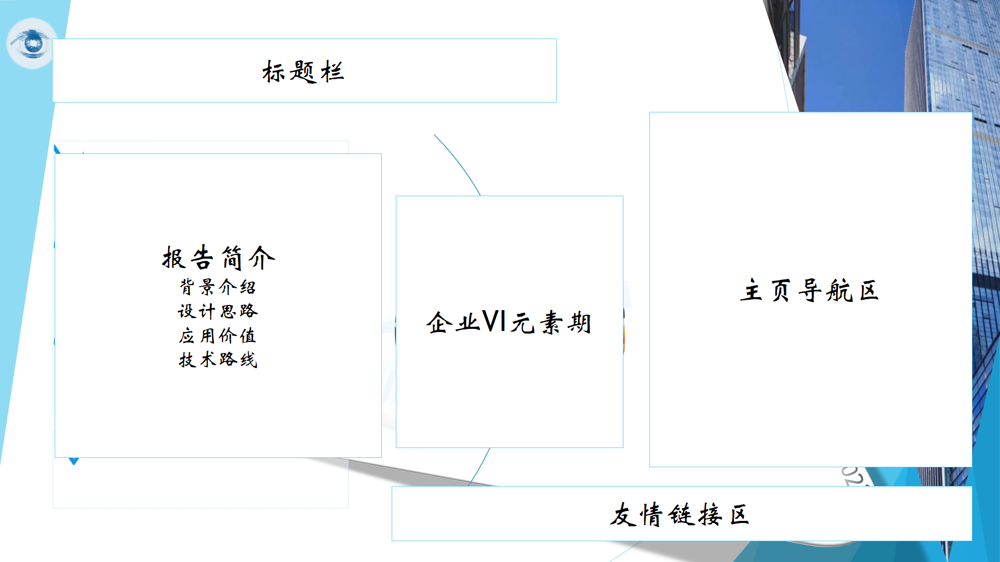
  - 1.标题栏
  - 2.报告简介
    - 背景介绍
    - 设计思路
    - 应用价值
    - 技术路线
  - 3.企业VI元素期
  - 4.主页导航区
  - 5.友情链接区

---

- **2.摘要**

  - 1.导航区
  - 2.过滤组件
  - 3.分析结论展示区
  - 4.多维分析数据可视化区
  - 5.行业对标与关键指标可视化区域

---

- **3.经营现状分析**
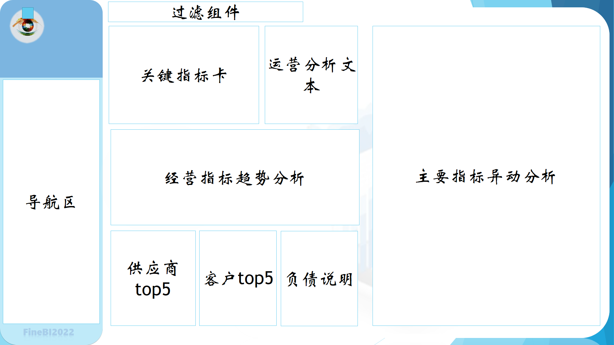
  - 1.导航区
  - 2.过滤组件
  - 3.关键指标卡
  - 4.运营分析文本
  - 5.经营指标趋势分析
  - 6.供应商TOP5
  - 7.客户TOP5
  - 8.负债说明
  - 9.主要指标异动分析

---

- **4.盈利能力维度**
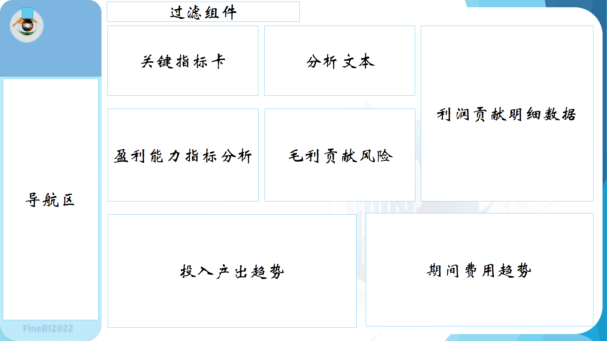
  - 1.导航区
  - 2.过滤组件
  - 3.关键指标卡
  - 4.分析文本
  - 5.盈利能力指标分析
  - 6.毛利贡献风险
  - 7.利润贡献明细数据
  - 8.投入产出趋势
  - 9.期间费用趋势

---

- **5.运营能力维度**
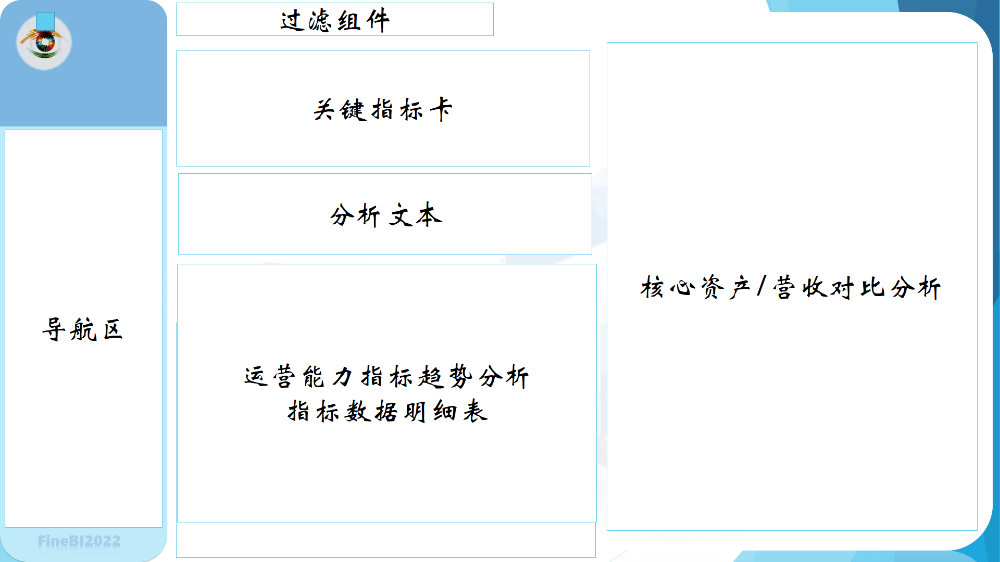

  - 1.导航区
  - 2.过滤组件
  - 3.关键指标卡
  - 4.分析文本
  - 5.运营能力指标趋势分析
  - 6.指标数据明细表
  - 7.核心资产/营收对比分析

---

- **6.成长能力维度**
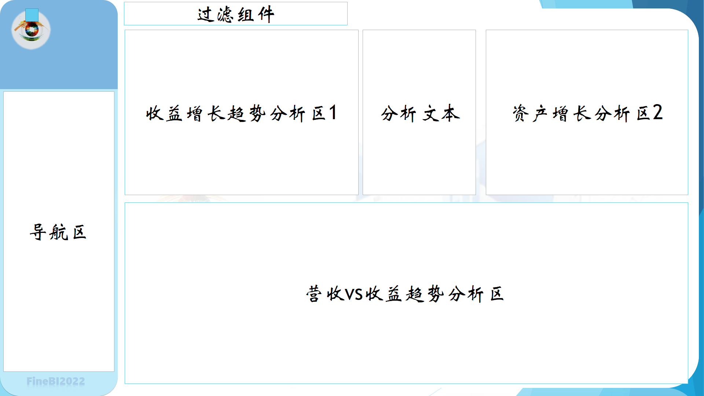

  - 1.导航区
  - 2.过滤组件
  - 3.收益增长趋势分析区1
  - 4.分析文本
  - 5.资产增长分析区2
  - 6.营收VS收益趋势分析区

---

- **7.偿债能力维度**
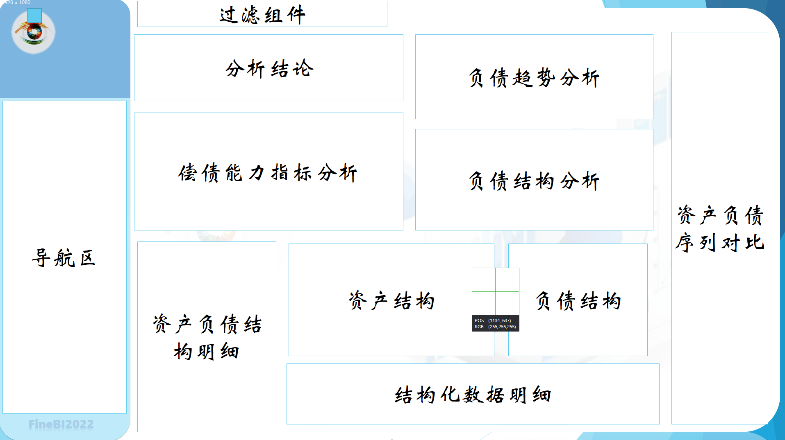
  - 1.导航区
  - 2.过滤组件
  - 3.分析结论
  - 4.负债趋势分析
  - 5.偿债能力指标分析
  - 6.负债结构分析
  - 7.资产负债序列对比
  - 8.资产负债结构明细
  - 9.资产结构
  - 10.负债结构
  - 11.资产负债序列对比
  - 12.结构化数据明细

---

- **8.现金能力维度**
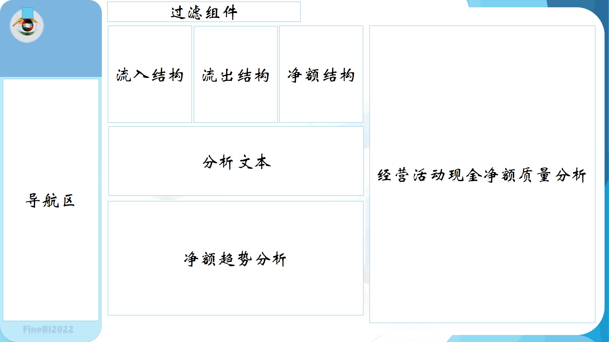
  - 1.导航区
  - 2.过滤组件
  - 3.流入结构
  - 4.流处结构
  - 5.净额结构
  - 6.分析文本
  - 7.净额趋势分析
  - 8.经营活动现金净额质量分析

---

- **9.杜邦体系模型**
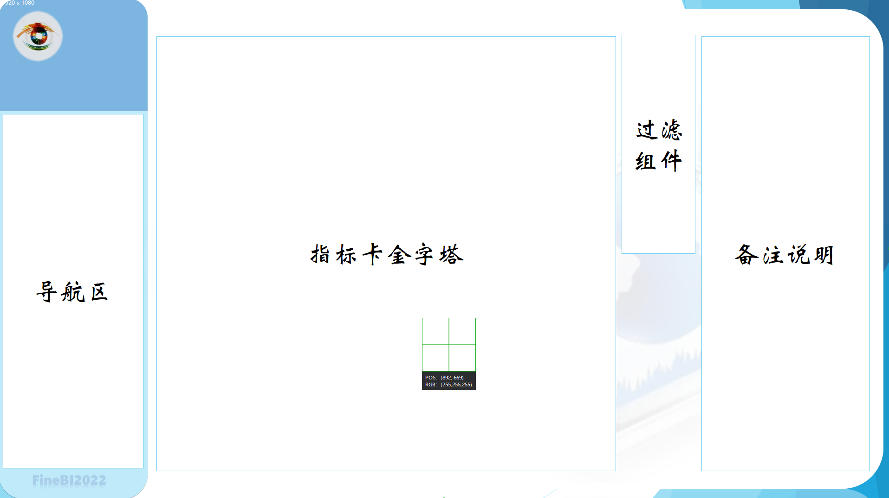
  - 1.导航区
  - 2.指标卡金字塔
  - 3.过滤组件
  - 4.备注说明

---

- **10.行业对标**
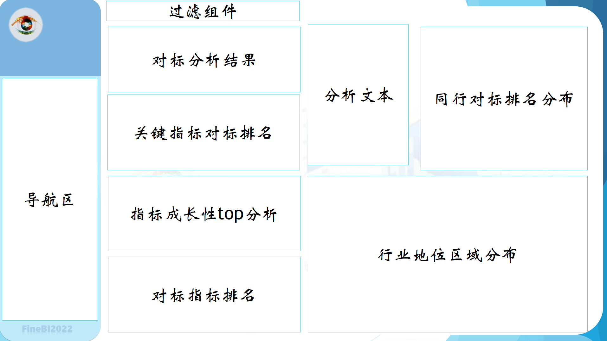
  - 1.导航区
  - 2.过滤组件
  - 3.对标分析结果
  - 4.关键指标对标排名
  - 5.分析文本
  - 6.同行对标排名分布
  - 7.指标成长性TOP分析
  - 8.对标指标排名
  - 9.行业地位区域分布

