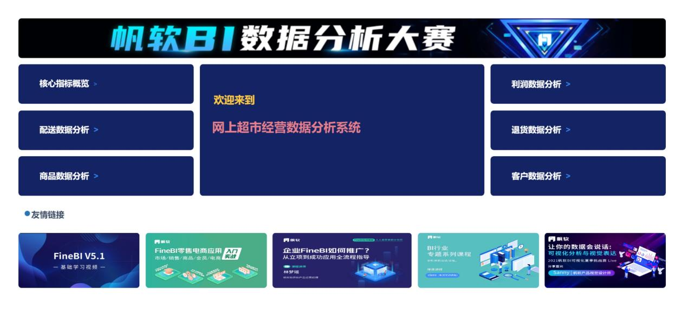
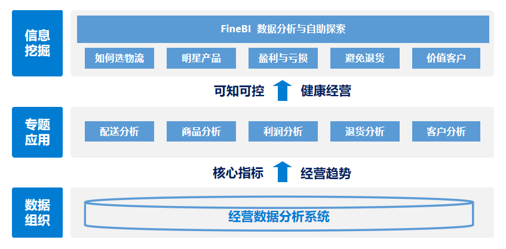
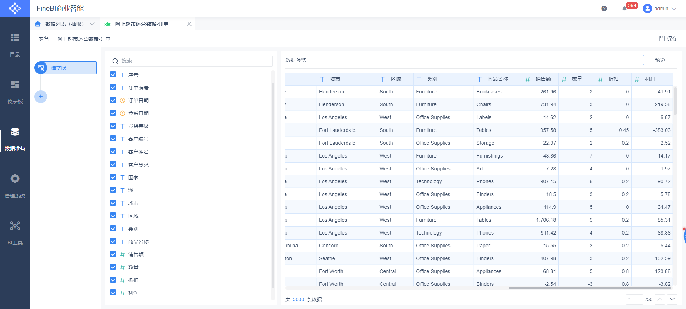
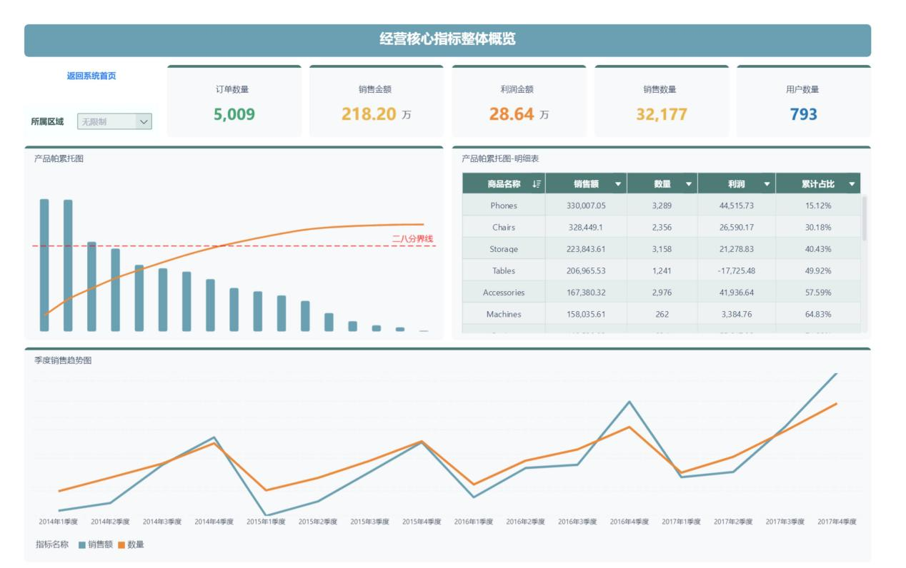
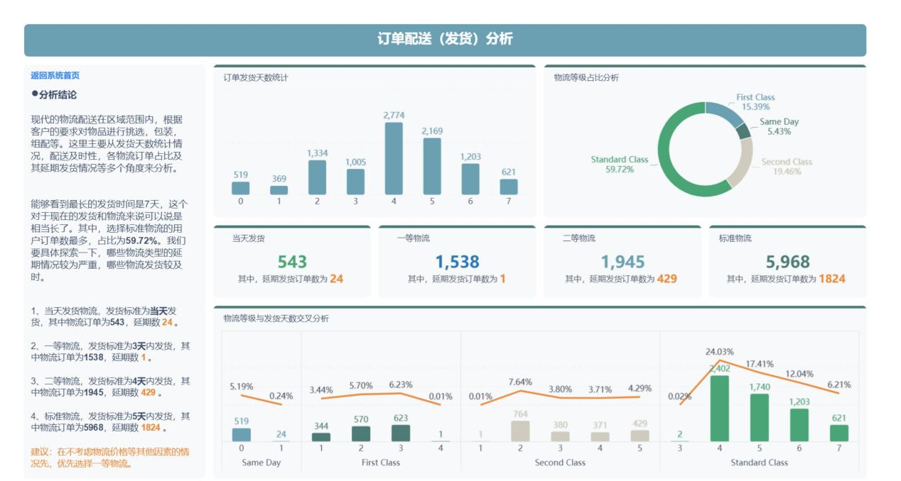
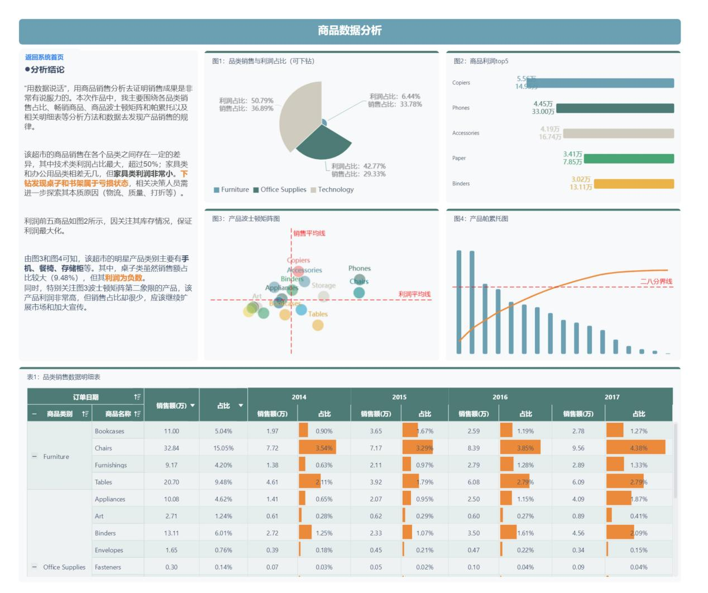
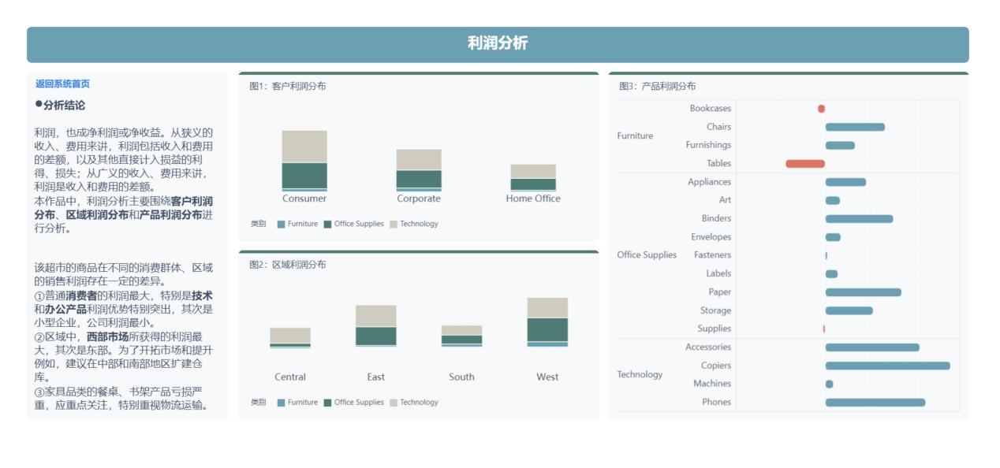
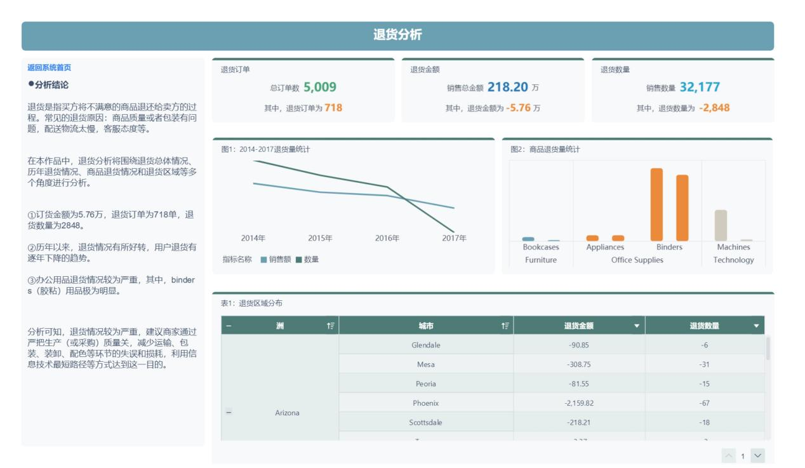
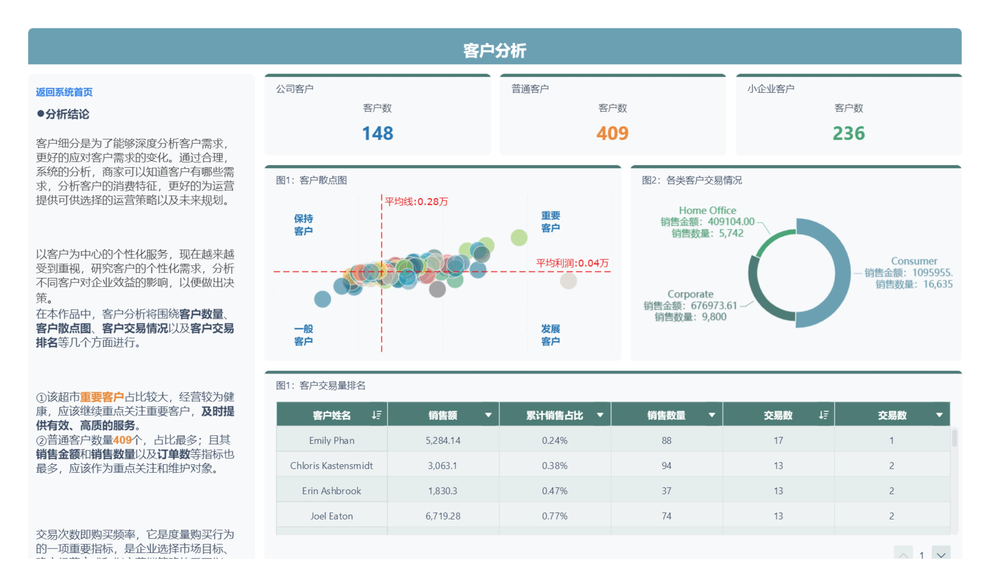
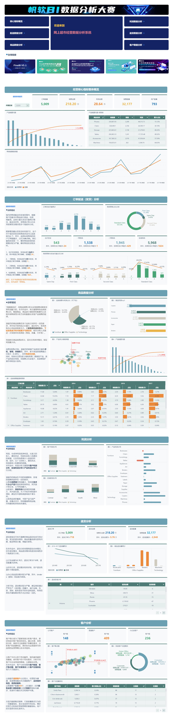

# 网上超市经营数据分析系统

## 一、背景介绍

### 1.1作品引言

- 这是一份工程量巨大的作品，因为它包括了1个首页+6个主题的内容。本来想早早把作品发出来，带带节奏，提高所有参赛选手的作品质量和创新方式。可因为内容太多，所以拖到了现在才收工。开始，大家还讨论要不要就选择其中一个专题深入分析就好，但后面觉得不够全面不够透彻，同时觉得这有点“配不上”导师这个身份。所以，在达成一致意见后索性就做成一个“分析系统”，把比赛内卷推到顶峰。

- 作品的思路来源于公司内部用FineReport做的其中一个项目，统一由一个首页跳转到不同的报表界面，这样就很好的解决了数据分析人员、业务人员看相关报表时找不着或者很难找的痛点。因为FineBI主要对象面向于业务人员，于是作品在原来的思路上也做了一定的扩展。为了满足业务人员的学习需求，于是把其中几个强相关的学习地址也通过链接的方式放到了系统首页，这样既满足了业务人员工作的需要，同时还能满足业务人员学习的需要。

### 1.2 业务背景

- 网上超市是指基于互联网的在线超市销售平台，为消费者提供物美价廉、种类丰富的超市商品批发、零售服务，这是一种新型的购物方式。目前，网络超市的竞争越来越激烈，在这种情况下，经营超市需要的是自身的管理和比其他普通超市优越的赢利点，而不是随波逐流的模仿和跟风。所以，对经营（运营）数据的分析显得尤为重要。
  - 本作品以某超市在2014-2017年共计4年的经营数据作为数据源，结合本公司某零售电商子公司的数据应用项目的分析思路，
  - 围绕**配送分析**、**商品分析**、**利润分析**、**退货分析**、**客户分析**等方面进行全面深入的分析。
  - 全面透彻的掌握**经营情况**，**发现问题**、**发现爆款**、**发现利润点**，让经营可知可控可预测，让经营因数据分析变变得更加健康。

## 二、作品框架

- 作品的内容包括了1个统一入口（含学习链接）首页+6个分析专题，其中这6个分析专题包括了整体**核心指标**、**配送**、**商品**、**利润**、**退货**和**客户**等内容。主要分析内容概述如下：
  - ①**核心指标概览**：经营指标汇总；商品销售怎样？经营趋势怎样？
  - ②**配送数据分析**：商品配送延期情况怎样？怎样才能选到最优的快递？
  - ③**商品数据分析**：由哪些明星产品和哪些亏损产品？
  - ④**利润数据分析**：哪些区域和用户能创造更大的利润？哪些产品利润有问题？
  - ⑤**退货数据分析**：退货趋势怎样？退货主要集中在哪些商品？如何避免？
  - ⑥**客户数据分析**：消费者分布如何？有哪些消费特征？

## 三、数据加工

- 数据来源于某数据产品内置数据库的网上超市经营数据（美国），整个过程包括了**解释翻译字段**，**选择分析字段**，**删除重复数据**，**删除无效数据**，**一致化处理**等。最终结果如下。

## 四、分析过程

### 4.1 核心指标概览

- 整体把握核心经营指标，包括销售指标、利润指标和用户指标，同时大体了解商品销售情况以及历史经营情况。

- 小结：数据结果显示，**畅销商品主要集中在技术类产品**。从2014年-2017年，经营情况呈现**不断增长**的趋势。同时，销售**具有明显的季节周期规律，第四季度销售增长特别明显，建议提前做好商品库存储备**。

### 4.2 配送数据分析

- 现代的物流配送在区域范围内，根据客户的要求对物品进行挑选，包装，组配等。本作品主要研究各种快递物流的延期情况，以便商家和客户选择更好的快递合作商，避免因为快递物流原因造成的退货发生。

- 小结：数据结果显示，标准物流的选择占比最高（猜测是因为价格原因），超过了一半，但其延期发货情况较为严重；**在不考虑物流价格等其他因素的情况下，建议优先选择一等物流**。

### 4.3 商品数据分析

- “用数据说话”，用商品销售分析去证明销售成果是非常有说服力的。本次作品中，经过简单的讨论，我们主要围绕各品类销售占比、畅销商品、商品波士顿矩阵和帕累托以及相关明细表等分析方法和数据去发现产品销售的规律。

- 小结：该超市的明星产品类别主要有**手机、餐椅、存储柜**等。其中，桌子类虽然销售额占比较大（9.48%），但其利润为负数。同时，特别关注图3波士顿矩阵第二象限的产品，该产品利润非常高，但销售占比却很少，应该继续扩展市场和加大宣传。

### 4.4 利润数据分析

- 经营的一切着陆点都应该是利润，所以接下来我们要对利润做几个方面的分析，包括**区域利润分析**，**客户利润分析**，**产品利润分析**。

- 小结：该超市的商品在不同的消费群体、区域的销售利润存在一定的差异。
  - ①普通消费者的利润最大，特别是技术和办公产品利润优势特别突出，其次是小型企业，公司利润最小。
  - ②区域中，西部市场所获得的利润最大，其次是东部。为了开拓市场和提升例如，建议在**中部和南部地区扩建仓库**。
  - ③家具品类的餐桌、书架产品亏损严重，应重点关注，特别**重视物流运输、市场费用和其他成本费用**。

### 4.5 退货数据分析

- 在本作品中，退货分析将围绕退货总体情况、历年退货情况、商品退货情况和退货区域等多个角度进行分析。

- 小结：
  - ①退货金额为5.76万，退货订单为718单，退货数量为2848。
  - ②历年以来，退货情况有所好转，用户退货有逐年下降的趋势。
  - ③办公用品退货情况较为严重，其中，binders（胶粘）用品极为明显。
- 数据显示，**退货情况较为严重**，建议商家通过**严把生产（或采购）质量关，减少运输、包装、装卸、配色等环节的失误和损耗，利用信息技术最短路径等方式达到这一目的**。

### 4.6 客户数据分析

- 客户细分是为了能够深度分析客户需求，更好的应对客户需求的变化。通过合理，系统的分析，企业可以知道客户有哪些需求，分析客户的消费特征，更好的为运营提供可供选择的运营策略以及未来规划。

- 小结：①该超市重要客户占比较大，经营较为健康，应该继续重点关注重要客户，及时提供有效、高质的服务。②普通客户数量409个，占比最多；且其销售金额和销售数量以及订单数等指标也最多，应该作为重点关注和维护对象。

## 五、结论建议

- **①配送专题**：数据分析结果显示，除了**一等物流**，其他类型的物流**发货延期较为严重**；建议相关工作人员注意监控**发货的及时性**，同时在不考虑其他因素的情况下**推行一等物流**，避免因为延期发货而造成的退货现象发生。
- **②商品专题**：数据显示该超市的**明星产品类别主要有手机、餐椅、存储柜**等。其中，桌子类虽然销售额占比较大（9.48%），但其利润为负数；建议**保障第四季度明星产品的库存**，同时对亏损产品做专题诊断。
- **③利润专题**：该超市的商品在不同的消费群体、区域的销售利润存在一定的差异。
  - 消费群体中，**普通消费者**的利润最大，特别是**技术和办公产品**利润优势特别突出；
  - 区域中，**西部市场**所获得的利润最大，为了开拓市场和提升例如，建议在中部和南部地区扩建仓库；
  - 需要注意，**家具品类的餐桌、书架产品亏损严重，应重点关注，特别重视物流运输、市场费用和其他成本费用**。
- **④退货专题**：**办公用品退货情况较为严重**，其中，binders（胶粘）用品极为明显；建议**做好整个供应链环节的数据分析和跟踪动作**。
- **⑤客户专题**：数据显示，**重要客户**占比较大，且在客户类型中**普通客户类型为主要消费群体**；建议做好普通客户群体的客情关系维护的同事，发展小企业用户和公司用户。

## 六、建议

- 关于FineBI，从4.0用到现在，彼此互相成长，对它的爱，就不在描述。再次借这次BI数据分析大赛的机会，“吐槽”它所欠缺的部分。

- **数据管理部分**
  - ①数据集表头不可直接排序，影响对数据的直接检查（升降序）
  - ②数据集不可直接导出（有些用户只是想导出即可，做个明细表再导出就多余了）
  - ③数据集建立了关联视图后不能直接应用（还需创建自助数据集）
  - ④抽数部分（spider）缺少集群功能，单节点太危险（听说后续版本会完善）
- **组件（仪表板）部分**
  - ①组件类型偏少，比缺少甘特图、箱型图、茎叶图、等组件
  - ②颜色、形状属性应用组件较少，比如指标卡的上升、下降
  - ③钻取设置还不够简便，可参考tableau实现方式进行完善
  - ④组件样式->格式->显示序号，不能跟随字体的居中设置
  - ⑤仪表板悬浮布局并不友好，可参考FineReport的绝对布局完善
- **平台管理部分**
  - ①非超管不能做资源迁移，造成了极大困扰，各业务中心发版得依赖超管
  - ②收到他人的分享仪表板缺少信息提醒，不自己打开查看一下都不知道。

## 七、作品展示

- 作品合并长图

