# 数据可视化——销售数据分析

## 数据背景

- 这是微软的一个虚拟示例数据库，是基于一个生产自行车的虚构公司，这家公司生产金属和复合材料的自行车，产品销往北美、欧洲和亚洲市场。

## 一、研究数据确定分析目标

- 制作一个可视化报表第一步是研究数据和分析目标，一般会把数据按维度和指标进行组合，从而确定分析主题以及分析内容的次重点。

- 模型共包含7个表

|序号|表名|表关系|
|--|--|--|
|1|**Date**|Date与Sales表之间存在三种关系，分别表示订单日期、发货日期和截止日期。订单日期关系处于活动状态。 公司以每年 7 月 1 日为会计年度的起始日进行销售报告。 使用 Date 列将表标记为日期表。|
|2|**Product**|仅存储已完成的产品。|
|3|**Reseller**|描述经销商及其地理位置。 经销商向自己的客户销售产品。|
|4|**Customer**|描述客户及其地理位置。 客户在线购买产品（Internet 销售）。|
|5|**Sales**|在每个销售订单行存储一行。 所有财务价值均以美元 (USD) 为单位。 最早订单日期为2017.7.1，最晚订单日期为2020.6.15。|
|6|**Sales Order**|描述销售订单和订单行号，以及销售渠道（经销商还是 Internet）。 此表与 Sales 表之间存在一对一的关系。|
|7|**Sales Territory**|销售区域按组（北美、欧洲和太平洋）、国家和地区显示。 只有美国在区域级别销售产品。|

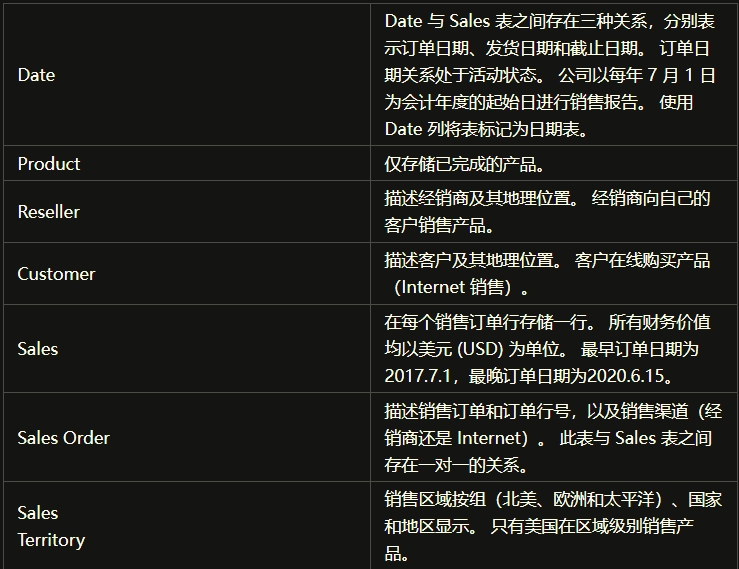

- 1.**Sales**是事实表，其中有三个日期字段订单日期、发货日期、截止日期，
  - 进一步观察发现订单日期和发货日期间隔都是7天，
  - 发货日期和截至日期间隔都是3天，因此发货日期、截止日期这两个字段没有分析价值。
- 2.此外，Sales还有几个指标：
  - **Order Quantity**（订购数量），
  - **Unit Price**（产品单价），
  - **Extended Amount**（应收金额），
  - **Sales Amount**（销售金额），
  - **Unit Price Discount Pct**（折扣，针对经销商），
  - **Product Standard Cost**（产品标准成本），
  - **Total Product Cost**（产品总成本），
  - 其中最重要的指标是销售金额，订购数量，然后由成本可以计算出利润。
- 3.**Sales Order** 包括了每一笔订单包含的产品，
  - 根据这个数据会做一个购物篮分析。另外根据订单数量还可以计算客单金额。
- 4.其他表都是维度表，
  - 由**DateTables**这个维度会分析各个指标随时间的趋势；
  - 从**ProductTables**这个维度确定了两个分析主题，产品的各项销售指标以及最畅销的产品；
  - 从**CustomerTables**和**ResellerTables**分别分析线上客户和经销商这两种销售渠道的各种行为；
  - **Sales TerritoryTables**分析销售区域的分布。
  - 另外还有一个**OVERVIEWTables**总览页提炼每一个分析主题的重要内容，以及一个TOPN页，聚焦前几或者后几的维度和指标。

## 二、规划报表结构

- 接下来根据上一步归纳出来的分析主题规划报告结构，在这个报告里面会考虑：
  - a) 一个分析主题一个报表页，保证一个页面内分析主题的统一。
  - b) 根据分析内容的数量和重要性安排一个主题页面内的内容结构。布局方式考虑等分、对称，黄金比例等。
  - c) 最大限度利用报表空间、增强内容的凝聚，比如更紧凑的布局；多用书签做相同的内容的折叠、展开、切换。
  - d) 整体报告用导航串起逻辑结构，个别报表页利用钻取做交叉分析。
  - e) 提供足够的报告说明，比如报表页说明，指标说明，交互说明。

## 三、可视化设计

- 为了提升报告的实用性，设计感，还需要在可视化设计上做一些优化，下面是会遵循的一部分原则：
  - 层级结构清晰：这里主要指的是一个页面的内容层次结构，一般考虑的方法有用背景颜色变化来构建内容的层次和突出重点内容，用分割线、标题来分割内容等。
  - 合适留白、可视化元素严格对齐。
  - 语义统一：包括颜色含义，单位，显示样式，术语等。
  - 版式统一: 包括统一的页面大小、视图类型和背景设置；统一的页面边距，板块间距等等。
  - 格式统一：统一的图表通用设置（背景、阴影、边框等等）；统一的图表格式设置（比如图例，XY轴，数据标签等等）；统一的字体字号等等。
  - 设计语言一致：一致的筛选区域，一致的导航设计、一致的功能设计（比如书签切换的样式保持一致）
- 最后，保持简洁的同时增加一定的细节，比如个性化的标题图标。

## 四、增强交互

- 合适的交互可以帮助读者更好地探索报告，在这个报告中，交互主要有这几类：
  - 内容跳转、层级下钻和钻取、筛选、参数。
  - 比如每个报表页面都会提供其他维度的筛选，以便让报表使用者更好的细分探索数据，
  - 还比如报告中多个地方会使用钻取功能实现不同板块之间的交叉分析，
  - 另外整个报告用的最多的交互是利用书签做内容的展开折叠，
  - 内容的切换和跳转，这可以帮助我们更好的做数据叙事。

## 五、报告细节

### 1. 总览页

- 总览页面是重要指标的集合，主要包括销售金额和利润随时间的趋势，并且选择特定时间点可以钻取至产品、地区、客户等相关分析，另外还包括Topn产品，渠道，地区的概览。
- 总览页面还包括报告的说明以及报告的导航。

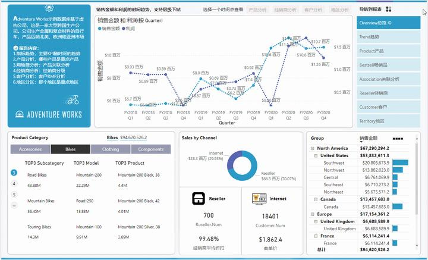
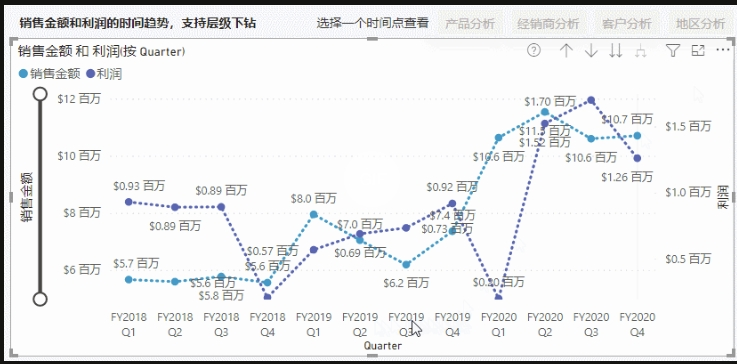

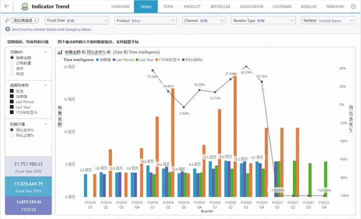

### 2、 指标趋势

- 在指标趋势这个页面通过计算组实现了指标和维度的自由切换，可以切换指标、选择列序列以及切换行值，并支持层级下转。

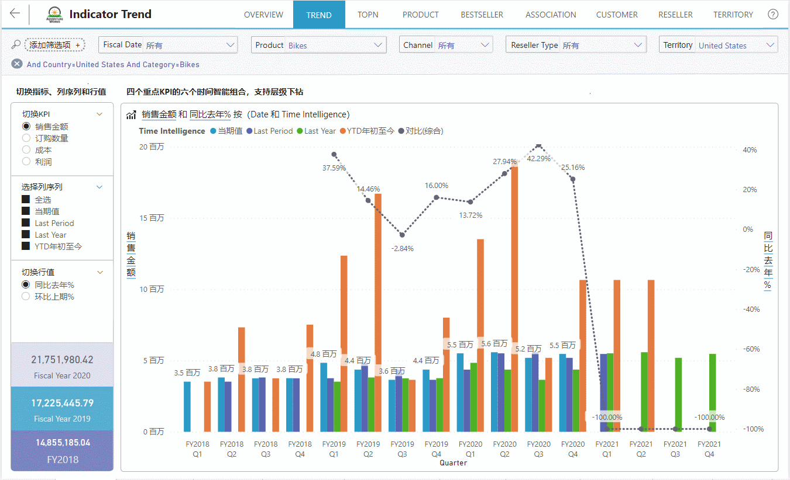
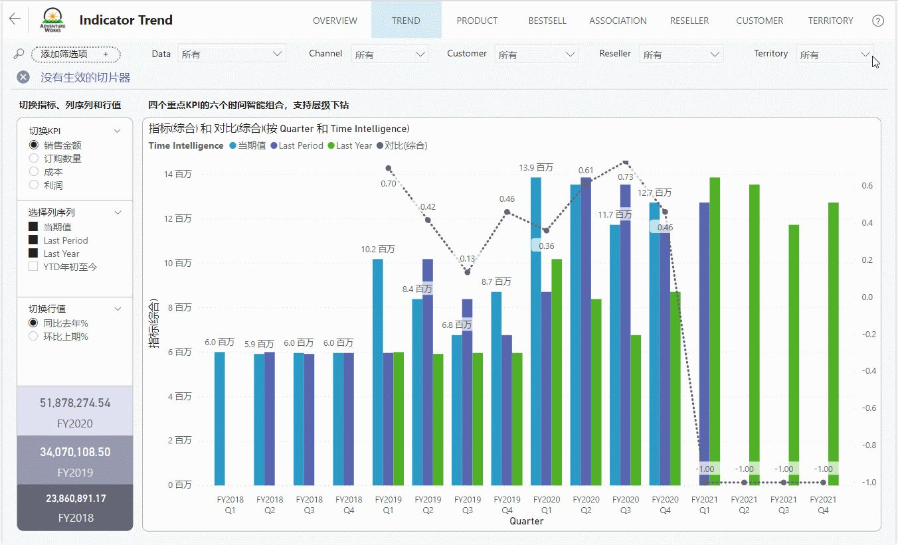
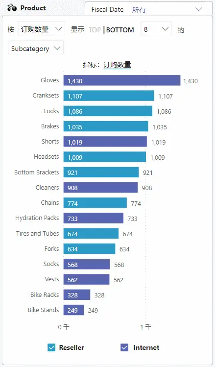
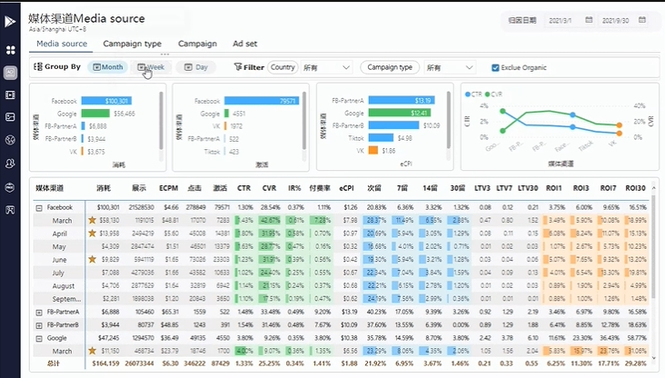

### 3、产品分析

- 产品分析页面包含销售金额或订购数量按`Category, Subcategory, Model, Product`分解；
- 产品按销售金额和利润分布；
- 产品的帕累托分析，支持参数动态设置阈值。

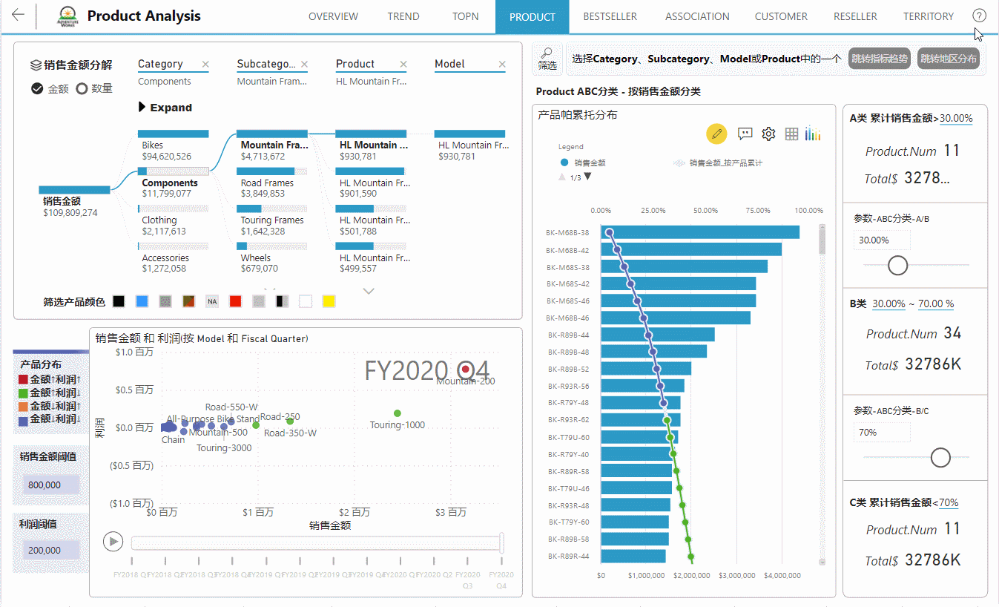
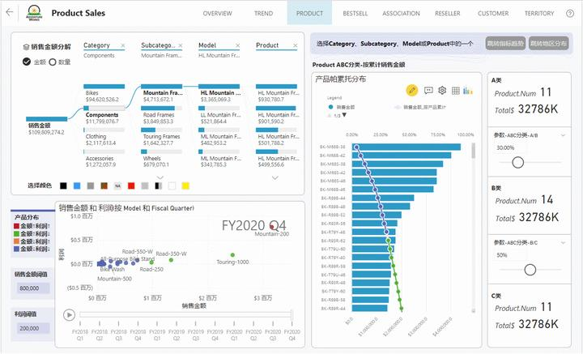

### 4、畅销品分析

- 畅销品分析这个页面包括：
  - 销售金额;
  - 销售数量;
  - 利润TOP3产品；
- 销售金额TOP10-TOP50产品（利用书签实现了类似翻页器的效果）；
- 不同国家和渠道的销售金额TOP10产品以及不同年份不同季度的销售金额TOP10产品。

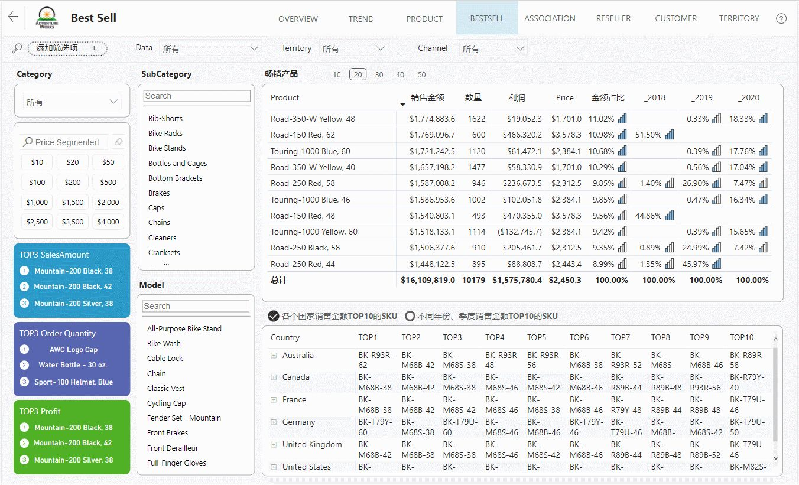

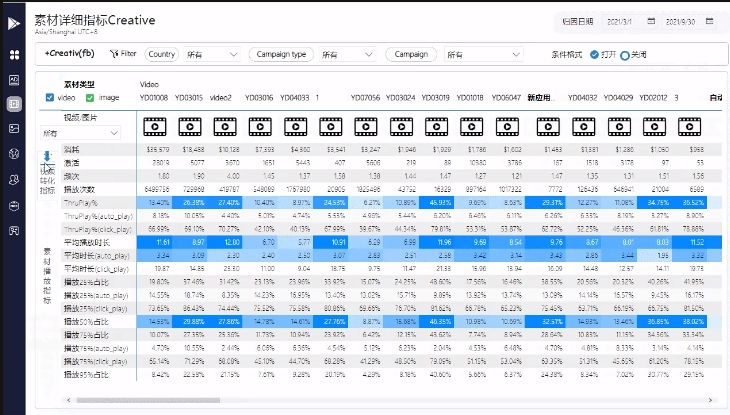

### 5.关联规则

- 关联规则包括两部分：
  - (1) DAX实现的两个子项的购物篮分析；
  - (2) Python实现的多个子项的购物篮分析。

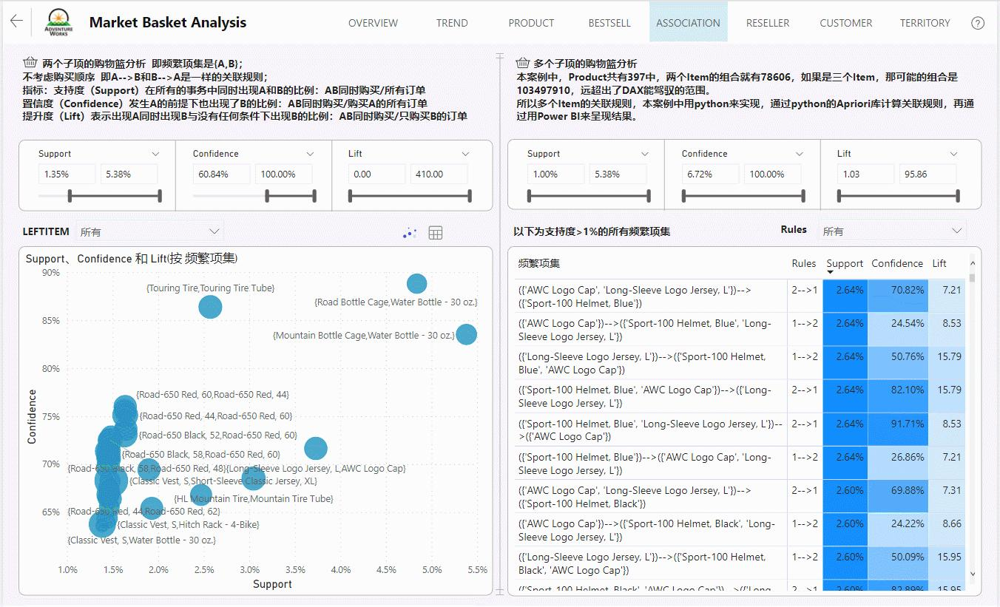
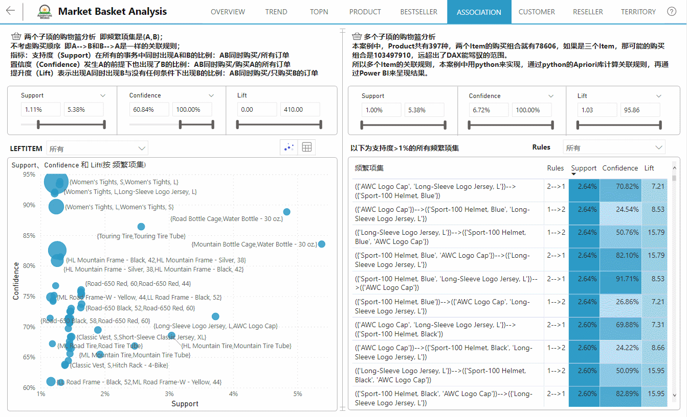
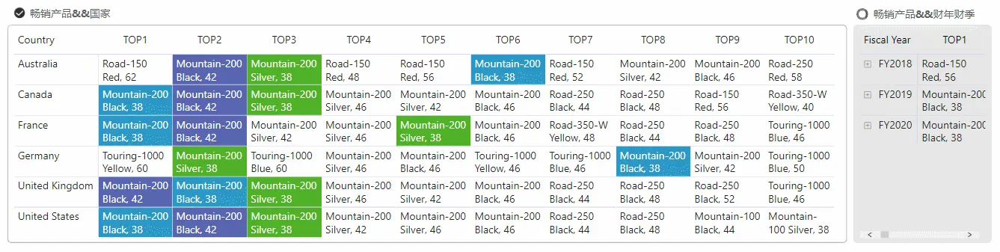
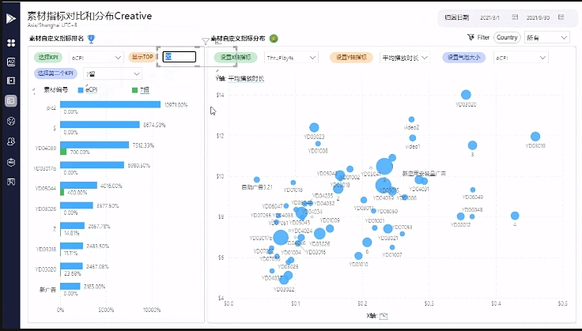

### 6.经销商分析

- 在经销商分析这个页面按不同类别分析各个经销商销售金额、销售金额星级以及不同类别的经销商按销售金额和利润的分布，另外通过Power Apps制作了一个管理经销商的简单应用。

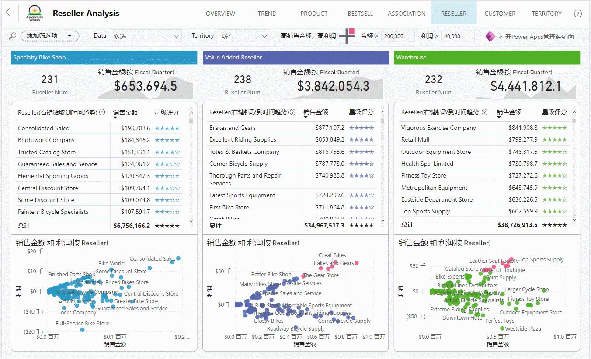
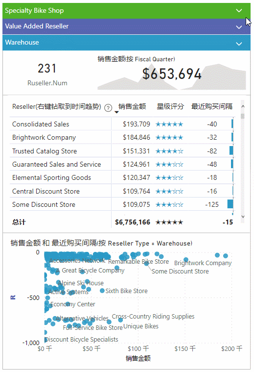

### 7.客户分析

- 客户分析方面主要以**RMF**模型来评估客户的价值，
  - 包括客户的**RMF**分布（分为重要用户、一般用户）；
  - 每个类别客户的数量；
  - 每个客户的消费行为明细。

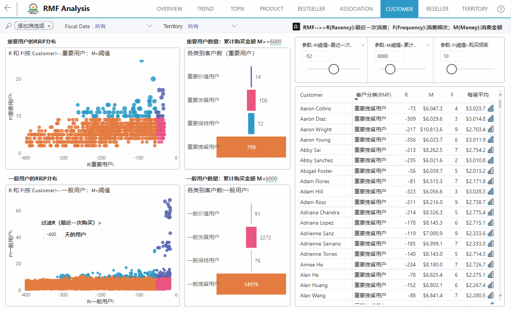
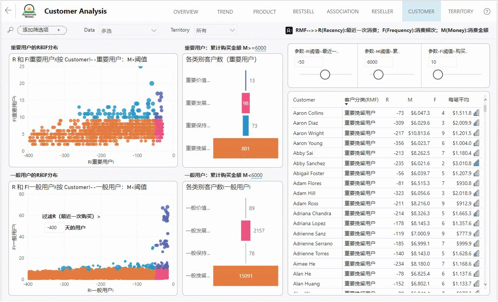

### 8.地区分析

- 最后一个是地区分析包括不同Group、国家、地区的销售金额占比；
- 不同国家的销售金额随年份变化；
- Reseller渠道不同国家、省/州、城市的销售金额；
- Internet渠道不同国家、省/州、城市的销售金额。

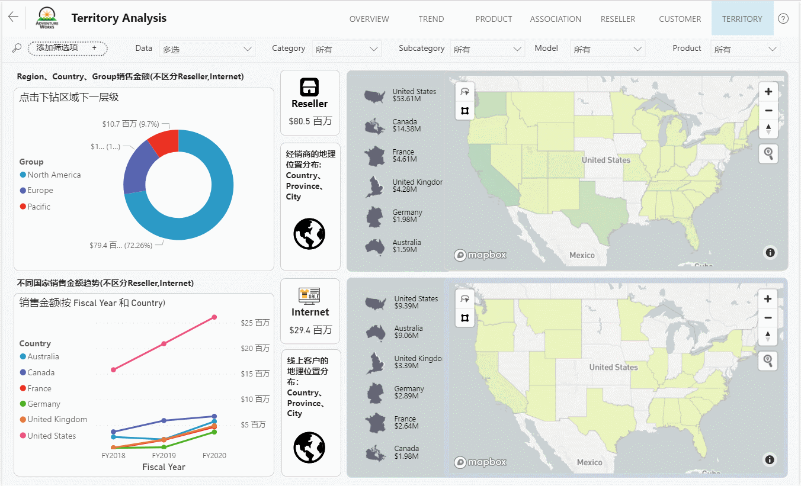
