# 数据可视化案例——银行理财产品购买预测

## 一.作品概况:

- 本作品以**某银行理财产品购买预测**为分析诉求，从A银行的 **销售渠道、客户构成、成品构成、购买分析、模型输出**进行分析，选取厦门某企业的脱敏数据进行脱敏分析，引入**RFM、帕累托、K-MEANS**相关模型，提供“把合适的商品推荐给潜在购买用户”的决策建议。

## 二、作品介绍

### 1、业务背景/需求痛点

- 背景
  - 背景：
    - 随着科技发展，厦门某A银行陆续打造了线上线下、丰富多样的客户触点，来满足客户日常业务办理、渠道交易等需求。面对着大量的客户，A银行需要更全面、准确地洞察客户理财需求。
  - 任务：
    - 针对客户购买各类理财产品的概率进行预测，并将预测结果作为营销方案的依据。
    - 通过预测结果，商家可以确定谁可以转换为重复买家。
    - 通过瞄准这些潜在客户，商家可以大大降低营销成本，提高投资回报率。
- **业务背景**：随着科技发展，厦门某A银行陆续打造了线上线下、丰富多样的客户触点，来满足客户日常业务办理、渠道交易等需求。面对着大量的客户，A银行需要更全面、准确地洞察客户理财需求。
- **需求痛点**：在实际理财产品业务开展过程中，A银行需要挖掘不同理财产品对客群的吸引力，从而找到目标客群，进行针对性营销。

### 2.数据来源

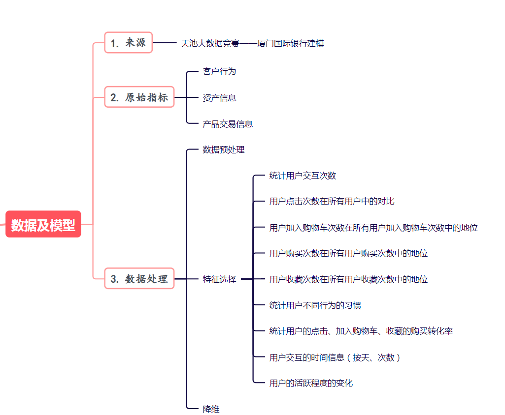

- 数据及模型
  - 1.数据来源
    - 天池大数据竞赛——厦门国际银行建模
  - 2.原始指标
    - 客户行为
    - 资产信息
    - 产品交易信息
  - 3.数据处理
    - 数据预处理
    - 特征选择
      - 1.统计用户交互次数
      - 2.用户点击次数在所有用户中的对比
      - 3.用户加入购物车次数在所有用户加入购物车次数中的地位
      - 4.用户购买次数在所有用户购买次数中的地位
      - 5.用户收藏次数在所有用户收藏次数中的地位
      - 6.统计用户不同行为的习惯
      - 7.统计用户的点击、加入购物车、收藏的购买转化率
      - 8.用户交互的时间信息（按天、次数）
      - 9.用户的活跃程度的变化
    - 降维

|表名|描述|数据来源|
|--|--|--|
|公司对比行业获客渠道|记录A银行和行业在不同渠道的获客占比|银监会公布相关报告|
|交易流水表|记录每个用户近两年的交易情况|天池大数据竞赛企业提供数据|
|APP行为表|记录每个用户在APP的点击次数|天池大数据竞赛企业提供数据|
|银行概况|记录各城市各月份的进出港人数|该企业公布年报|
|银行网点分布|记录A银行在各城市的网点|该企业公布年报|

**附录1：FINEBI数据连接**

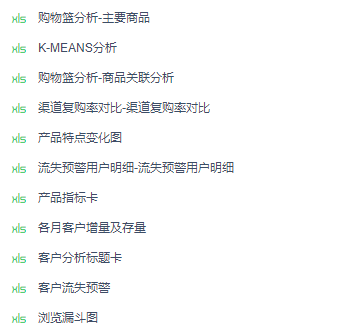

- 1.近期客户浏览分布.xls
- 2.公式对比行业获客渠道.xls
- 3.客户表.xls
- 4.交易流水表.xls
- 5.不同时点客户资产表.xls
- 6.APP行为表.xls
- 7.银行概况.xls
- 8.银行网点分布.xls
- 9.主要股东客户.xls
- 10.购物篮分析——主要商品.xls
- 11.K-MEANS分析.xls
- 12.购物篮分析——商品关联分析.xls
- 13.渠道复购率对比——渠道复购率对比.xls
- 14.产品特点变化图.xls
- 15.流式预警用户明细——流失预警用户明细.xls
- 16.产品指标卡.xls
- 17.各月客户增量及存量.xls
- 18.客户分析标题卡.xls
- 19.客户流式预警.xls
- 20.浏览漏斗图.xls

### 3.分析思路

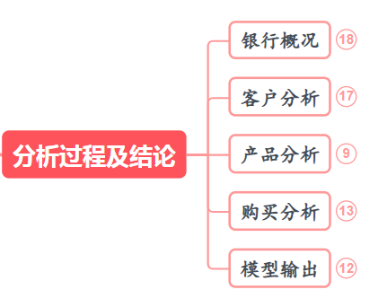

- 分析过程及结论
  - 1.银行概况
  - 2.客户分析
  - 3.产品分析
  - 4.购买行为分析
  - 5.模型输出

#### 3.1 银行概况

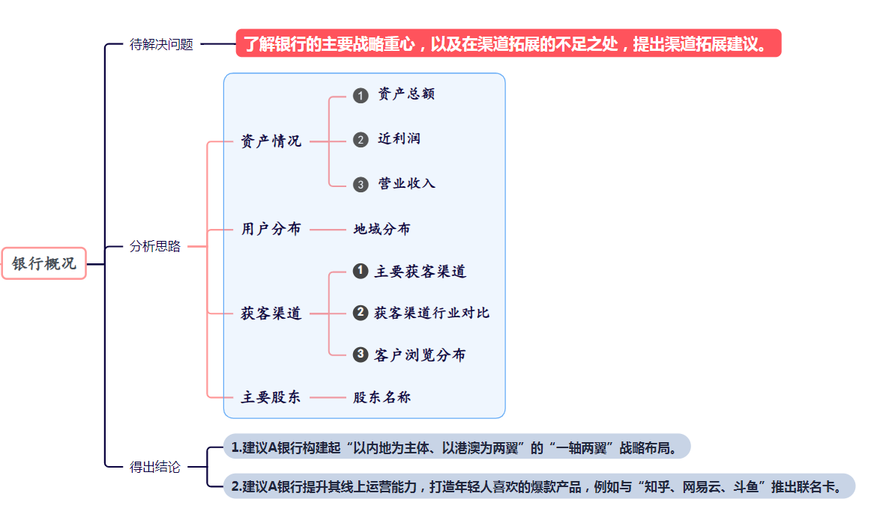

- **银行概况**
  - **待解决问题**
    - **了解银行的主要战略重心，以及在渠道拓展的不足之处，提出渠道拓展建议。**
  - **分析思路**
    - 资产情况
      - 1.资产总额
      - 2.净利润
      - 3.营业收入
    - 用户分布
      - 地域分布
    - 获客渠道
      - 1.主要获客渠道
      - 2.获客渠道行业对比
      - 3.客户浏览分布
    - 主要股东
      - 股东名称
  - **得出结论**
    - 1.建议A银行构建起“以内地为主体、以港澳为两翼”的“一轴两翼”战略布局。
    - 2.建议A银行提升其线上运营能力，打造年轻人喜欢的爆款产品，例如与“知乎、网易云、斗鱼”等合作推出联名卡。

#### 3.2 客户分析

- **待解决问题**
  - **了解A银行的用户变化情况，对用户进行分类，预警出“最有可能购买”“最有可能流失”的用户。**
- **分析思路**
  - 采用的是**RFM模型**来对客户价值的影响因素进行全面分析。通过分析客户特征，评估客户价值，从而为客户制订相应的营销策略与资源配置计划。
    - **最近一次消费时间（R）**
    - **最近一段时间内消费频次（F）**
    - **最近一段时间内消费金额（M）**
- **结论及建议**
  - ①A银行的月流失客户数也相对较高，导致净增量不足，建议A银行要重点关注客户流失问题。
  - ②部分客户购买金额虽然大，但是其复购率不高，是需要重点挽留的对象。

#### 3.3 产品分析

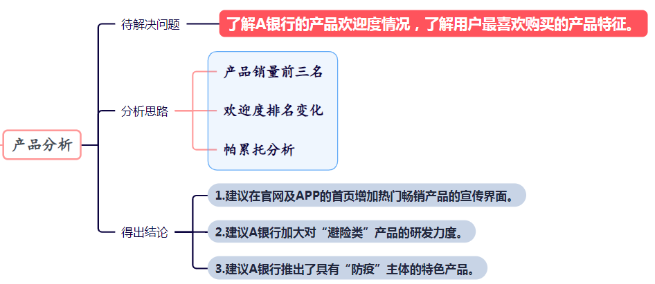

- **待解决问题**
  - 了解A银行的产品欢迎度情况，了解用户最喜欢购买的产品特征。
- **分析思路**
  - 1）计算不同品类商品累计销售额及其占比，
  - 2）按照累计销售占比将品类分成几类，示例将品类按照累计销售额占比
- **结论及建议**
  - ①建议在官网及APP的首页增加热门畅销产品的宣传界面。
  - ②2.建议A银行加大对“避险类”产品的研发力度。
  - ③建议A银行推出了具有“防疫”主体的特色产品。

#### 3.4 购买分析

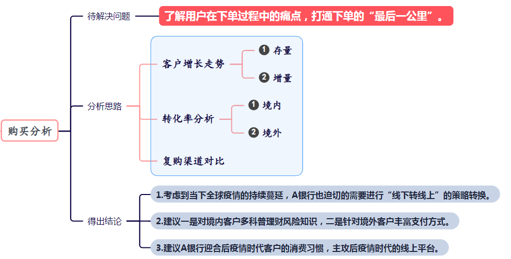

- **待解决问题**
  - **了解用户在下单过程中的痛点，打通下单的最后一公里。**
- **分析思路**
  - 通过“漏斗分析模型”，反映用户行为状态以及从起点到终点各阶段用户转化率情况。用户从首页进入最终完成支付的行为，大多需要经过几个环节，从理财产品浏览——查看产品详情——加入购物车——生成订单——风险等级评估——完成支付。这其中的每个环节都有一定的转化率，该模型通过监控用户在流程上各个层次的行为路径，寻找每个层级的可优化点，提高用户在每个层级之间的转化率，最终来提高总成交金额。
- **结论及建议**
  - ①考虑到当下全球疫情的持续蔓延，A银行也迫切的需要进行“线下转线上”的策略转换。
  - ②建议一是对境内客户多科普理财风险知识，二是针对境外客户丰富支付方式。
  - ③建议A银行迎合后疫情时代客户的消费习惯，主攻后疫情时代的线上平台。

#### 3.5 模型输出

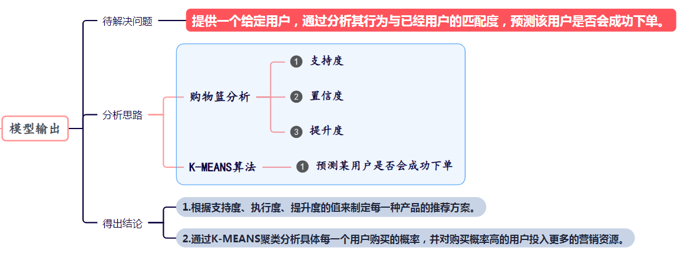

- **待解决问题**
  - **了解用户在下单过程中的痛点，打通下单的“最后一公里”。提供一个给定用户，通过分析其行为与已经用户的匹配度，预测该用户是否会成功下单。**
- **分析思路**
  - **模型①：购物篮分析**
    - 通过购物篮分析找出什么样的理财产品应该放在一起。通过顾客的购买行为来了解是什么样的顾客以及这些顾客为什么买这些产品，找出相关的联想规则，并通过这些规则的挖掘获得利益与建立竞争优势。
  - **模型②：K-MEANS聚类分析**
    - K-Means(K均值)是聚类最常用的方法之一，基于点与点距离的相似度来计算最佳类别归属。针对每个点，计算这个点距离所有中心点最近的那个中心点，然后将这个点归为这个中心点代表的簇，不断迭代，直到前后两次迭代的簇类没有变化。
- **结论及建议**
  - ①根据支持度、执行度、提升度的值来制定每一种产品的推荐方案。
  - ②通过K-MEANS聚类分析具体每一个用户购买的概率，并对购买概率高的用户投入更多的营销资源。

### 4 数据处理

|数据处理|作用|应用场景|
|--|--|--|
|脱敏|数据脱敏之后，依然要保持一致性和关联性|企业数据脱敏|
|网络爬虫|通过Python爬取**百度疫情**每日更新的新增确诊人数、中高风险地区数。|用来判断某城市疫情发生后，退座是否突增；研判城市清零时间（连续14天无社区传播）|
|月份淡旺指数|某城市的单月流量/该城市的该年的月均流量|结果>1则为该城市的旺季，反之为该城市淡季|
|销售异动指数|本期销售额/同周期销售额，预警销售的突增和突减|订座、退座是否发生突增(关联疫情市场)|

### 5 可视化报告

#### 5.1 作品介绍

#### 5.1.1 银行概况

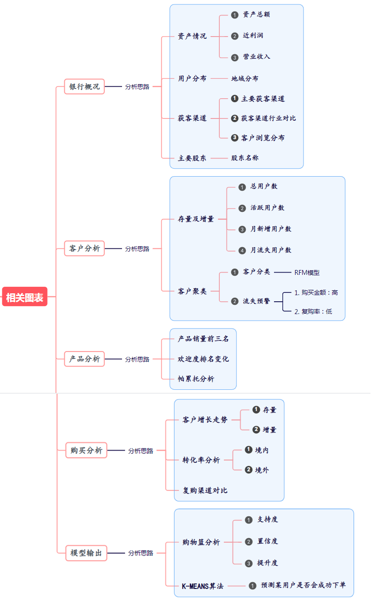
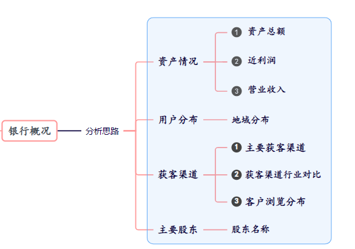
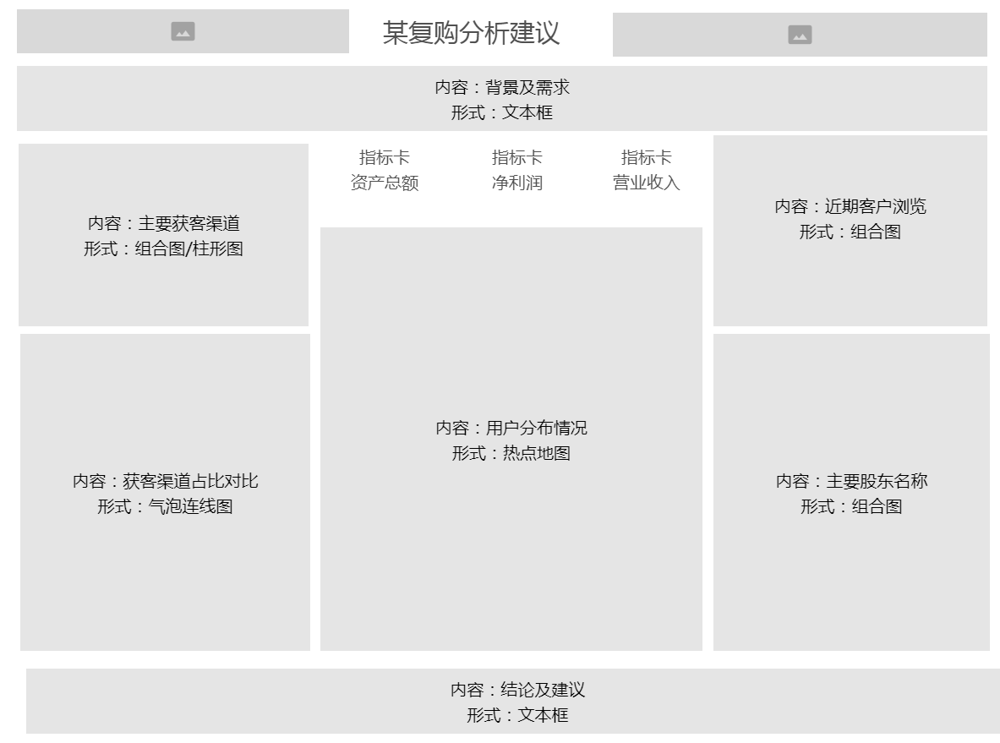
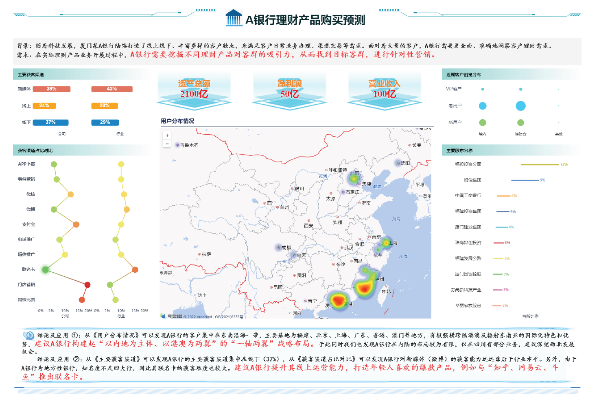

#### 5.1.2 客户分析

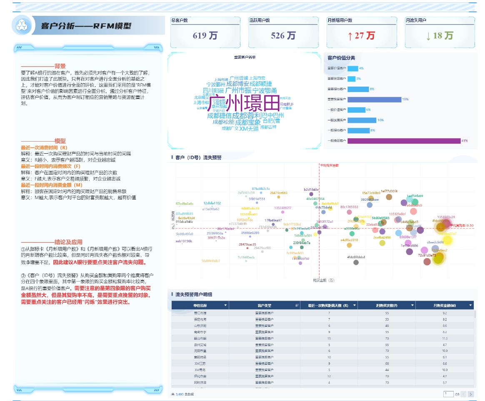

#### 5.1.3 产品分析

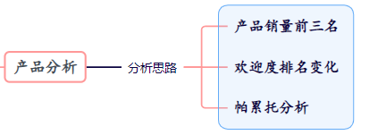
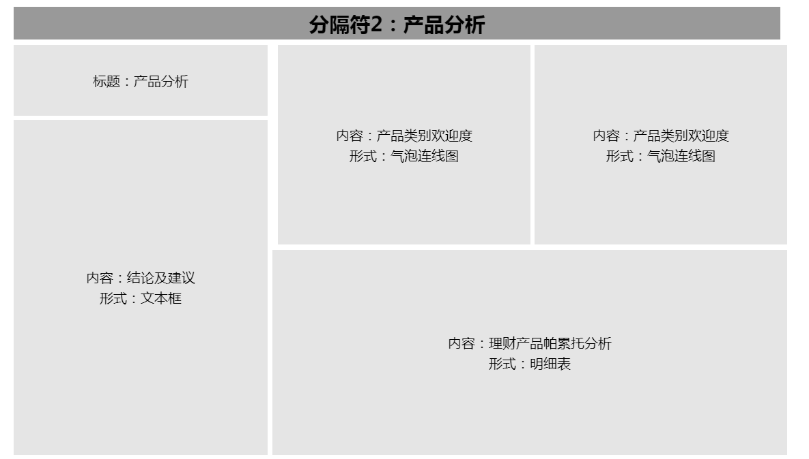
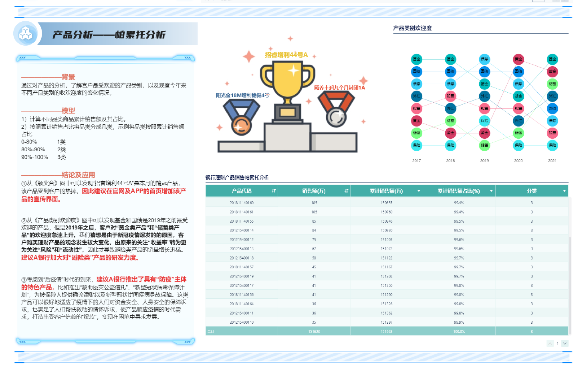

#### 5.1.4 购买分析

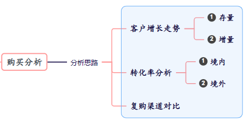

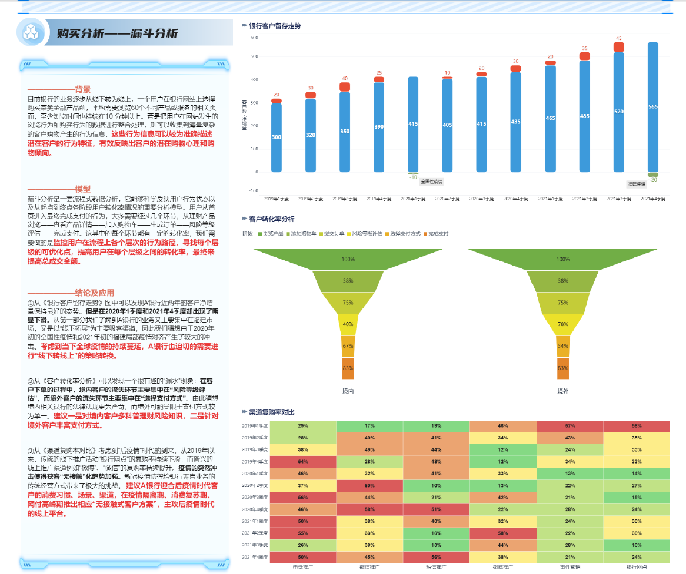

#### 5.1.5 模型输出

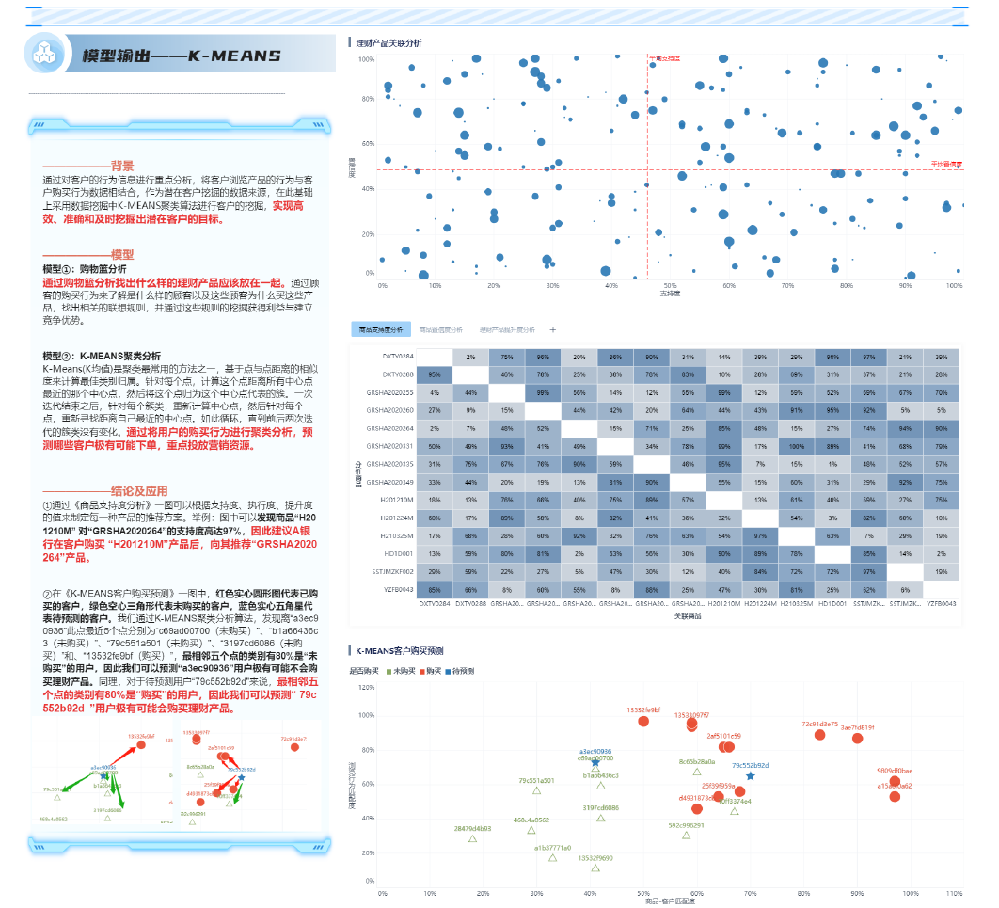

### 5.2 图表排版布局

- ①配色设置：以浅色系为主色调。
- ②图表设置：图表的背景网格线都去掉了。
- ③文字设置：突出的重点用橙色的文字表示，通过分析得出的结果用红色文字表示。
- ③布局设置：以流行地图、区域地图作为主要元素。
- ④文本说明：通过文本框展示“分析思路”“结论建议”，一般在模块的最开始和结尾位置。

### 5.3 最终结果呈现的页面布局

## 三、参赛总结

- **1、FineBI工具**
- BI工具优点多多，比如“帮助文档非常详尽、课程学习非常丰富、数据连接非常顺畅”。
- 建议BI工具新增数据分析建模的功能，建议一个数据预处理平台。比如类似于**KNIME**这类轻应用，可以直接调用一些数据处理的算法**（KNN\K-MEANS\PCA）**等等。目前我在处理数据的时候，基本上都是先通过Python处理完再导入数据库，在通过FINEBI直接数据库，感觉步骤相对繁琐一些。