# O2O模式下的机会分析

## 一、团队介绍

- **团队名称：圈外女友队**
- 队长介绍：
  - **杨洋圈外女友**：
    - **一个即感情充沛又被数理化的理性思维禁锢的白羊座美少。从事过多个行业，企划、督导、经营分析，分析思维严谨，对数据非常敏感**。本次参赛中，担任队长，负责整体规划、分工，参与所有环节制作。
- 队员介绍：
  - **队友1-羽生结弦圈外女友**：
    - 冲刺空中旋转一周半，稳稳落地no problem~，**精通大数据各组件并对源码有深入研究，从事大数据研发7年+的码农，工作中统筹能力极强，善于思考**。本次参赛中，负责基础数据搭建，数据处理，数据脱敏，数据底层开发。
  - **队友2-权志龙圈外女友**：
    - 一**个精分，游离于沉稳大气与搞笑逗乐之间**，你一定分不清哪个是真实的我。**毕业于知名985高校，从事战略管理工作5年+，擅长公文写作，团队沟通和协作，工作中，认真负责，积极主动，逻辑思维清晰**。本次参赛中，负责大赛作品介绍、部分仪表板制作，分析思路共创。
  - **队友3-苏有朋圈外女友**：
    - 努力减肥的社畜。**法务会计毕业，思维严谨，擅于逻辑推理，从事管理会计9年+，从战略预算、经营分析、到财务BP，均有丰富的工作经验，深入业务内部，熟知业务流程和业务场景**。本次参赛中，负责整体分析思路共创，参与大赛作品介绍。
  - **队友4-朱正廷圈外女友**：
    - 一个“富婆”，梦想成为亿万富婆的刚毕业的小妹妹。**从事经营分析工作，工作认真，勤奋刻苦，擅于思考，执行力强，行动力快**。虽初入职场，已身经百战，本次参赛中负责整体仪表板制作，分析思路共创，参赛作品介绍编写，是一个多面小能手。

## 二、作品介绍

### 1、行业背景

- 互联网时代，尤其当前环境下，足不出户的购物体验已经成为大多数消费者的必要需求，O2O到家服务既能满足消费者线上体验，又能保证时效，所以在商品同质化较高的零售商中，O2O到家服务以及时效很大程度上影响消费者的选择。

### 2、业务背景

- 某国某公司在各地有数家线下零售门店，在互联网、新零售的行业背景下，公司定位实现全渠道线上线下互联、实践新零售的战略方向。
- 例如提出大力发展O2O到家服务，实现销售业绩的全面增长，O2O业务中面临两个痛点，
  - 第一如何更好的提升服务，主要是产品好，服务好，时效快；
  - 第二物流成本降本增效，主要是单均成本、物流费率的最优化。
- 对O2O到家服务的**业绩贡献**、**时效分析**、**物流成本**以及**消费者评价**来进行综合评价分析，帮助业务端及时调整策略，提升消费体验，满足升级需求，提升企业社会价值，进而创造满足会员全场景的全渠道消费体验是我们本次进行数据分析的目的。

### 3、前期准备

#### 3-1 团队选题

- 报名参与后，团队成员积极贡献智慧，集体召开小组会议对主题进行研讨，大家集思广益，纷纷抛出自己感兴趣的主题，后经过共同研讨、表决，形成最终的分析主题——零售行业O2O模式下的机会分析。

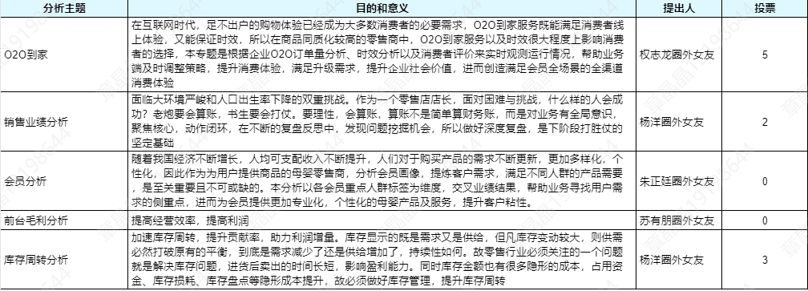

#### 3-2 拟定思路

- 根据既定主题，团队经过与专业业务、数据分析以及技术部门深入沟通后，拟定主要分析思路，经过头脑风暴，确定从业务大数到会员分析、商品分析、时效分析以及成本分析五个维度开展，娓娓讲述零售行业里O2O运行的模式以及过程中发现的机会点，希望能借助此套分析思路，为业务路径及决策提供有效支撑。

#### 3-3 分析框架

- 思路已出，如何往下深入，是团队接下来的重点任务。小组成员经过多次研讨&共创，在某个漆黑的深夜，分析框架最终呈现。

#### 3-4 分工及制作前准备

- 为更高效、合理的安排工作，团队内根据个人优势及兴趣点，对整个流程进行分工及节奏把控，最终形成进度表；同时对已经形成的分析框架，制定仪表板组建准备工作，为后续制定可视化报表提供充分准备。

### 4、分析思路

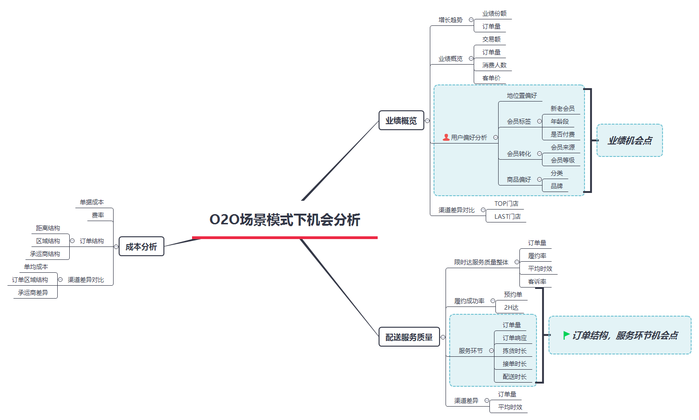

### 5、数据来源

#### 5.1 数据源说明

- 用到企业数据。企业是某国某公司数家线下大型零售门店
  - ①数据已经过脱敏处理，采集脱敏，关键字转换处理
  - ②为达到数据分析过程中可视化的直观性，已将源数据各门店的地理位置虚拟为中国的地理位置
  - ③由于数据量庞大，本次分析选取了数个门店在某个月份的数据进行分析，部分数据进行随机数生成的方法处理
  - ④所有名称均做不同方式的代号处理

#### 5-2 数据导入方法：

- 由于原则上无法直接使用企业数据，因此本分析数据均使用excel进行初步的数据处理，后使用SQL导入并进行脱敏处理。

#### 5-3 原始数据表含义简述：

- **事实表**：
  - ①订单交易数据表：O2O到订单维度的交易数据等，包含会员编码信息
  - ②会员信息表：会员信息数据，使用会员编码与订单交易数据表进行关联
  - ③订单时效表：订单号，订单配送时效，配送类型等服务时效信息
  - ④配送成本表：包含配送订单的成本数据，以及简单的配送信息
- **维度表**：
  - ①门店信息表：门店信息、门店对应的省份城市等，使用门店编码与订单交易数据关联
  - ②客诉内容表：含客诉的订单，以及客诉内容，使用订单号与订单时效表关联

### 6、指标定义

#### 6-1 O2O定义

- ①**O2O业务**：为线下零售门店通过线上APP、小程序等工具为消费者提供到家服务业务，包含两个服务产品，限时达和非限时达两种产品
- ②**订单类型**
  - **限时达**：线下零售门店同城5KM内订单，从消费者下单到送达消费者，2小时内实现，可满足门店周边消费者分钟级体验
  - **非限时达**：线下零售门店同城5KM以上订单，当天实现从消费者下单到送达消费者，可实现商品从区域中心仓集中配送，小时级体验

#### 6-2 会员相关数据定义：

- ①**新老会员**：新会员为首次消费时间在交易数据当月的顾客，其余为老会员
- ②**会员等级(L3-L7)**：为会员在我司的消费积分计算等级，即消费产值越高，等级越高
- ③**会员标签**：包含高中低活跃会员，忠诚会员，沉睡会员
  - a. 忠诚会员：近三月，每个月均有消费会员
  - b. 高活跃会员：近三月有两次消费
  - c. 中活跃会员：过去三月(即会员标签更新月的前三个月)消费一次，且过去六个月消费大于1次
  - d. 低活跃会员：过去六个月有一次消费，且过去十二个月有一次消费
  - e. 沉睡会员：过去十二个月仅一次消费

#### 6-3 时效相关数据定义：

- ①**2H达&预约单**：2H达为公司O2O业务中对时效要求的部分：2H内到达顾客指定地点预约单为顾客约定时间将商品送达
- ②**履约率**：是否在顾客预期的时间内送达，如为是，则为履约成功，如为否，则为履约失败，其公式=履约成功订单量/总订单量
- ③**平均时效**：每单从顾客下单到送货到家整个流程的时长，平均时效为时间均值
- ④**客诉率**：有客诉的订单量/总订单量

#### 6-4 成本相关数据定义：

- ①**单均成本**：每单订单需要的运费（不同供应商成本不同），衡量每单费用
- ②**物流费率**：物流费用与交易额的占比，衡量费用与交易之间的合理性
- ③**5公里+订单占比**：订单距离超过5公里的订单量与总订单量的占比，衡量选择到家业务距离上是否合理
- ④**同城**：顾客下单城市（门店发货城市）与目的地城市（订单送达城市）为同一个

### 7、数据处理

#### 7-1 数据处理的步骤

- ①**数据加工及清洗和脱敏**：
  - 将原始数据在PL/SQL Developer下使用Text Importer导入到数据库中，经过加工处理成需要的事实表和维度表。原始数据加工过程中，用到dbms_random、update等命令进行脱敏等原始数据处理
- ②**整理各表之间的关联**：
- 整理事实表和维度表之间的关联图

#### 7-2 数据表之间的关联图

- 在使用多张SQL底表的时候，需要对表之间进行关联，特别是维度表与事实表之间，相当于Excel的匹配功能，同时可以通过对维度表进行权限控制，使不同用户身份进入可视化报表时看到的数据会根据权限改变，实现数据的保密性。

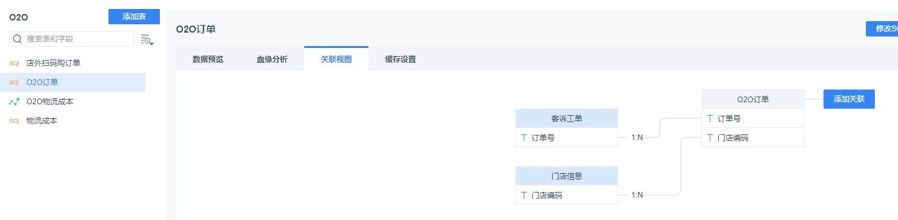
#### 7-3 建立自助数据集

- 自助数据集建立后可以进行多种操作，通过层层梳理，建立多种字段关系，简单轻松地处理新建字段，过滤等过程，方便快捷。
  - ①关联后选择需要的字段
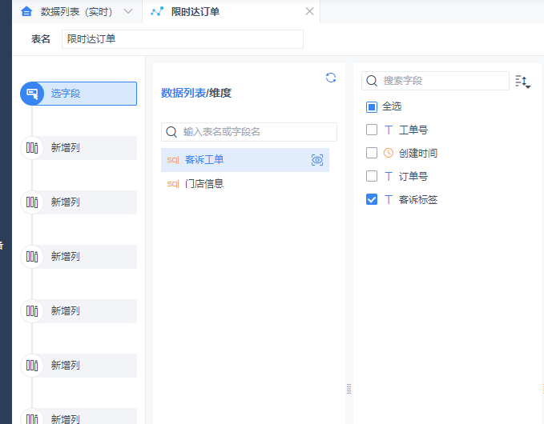

  - ②新增列，通过公式取需要的字段（此处运用DATESUBDATE函数处理时间差问题） 
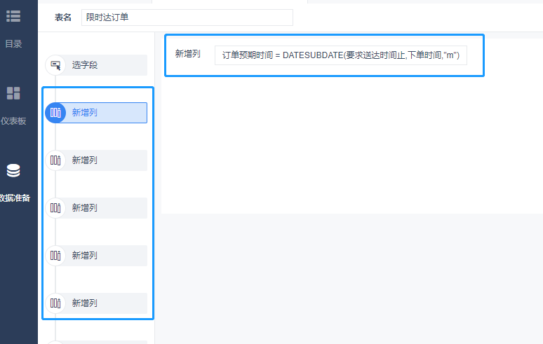

  - ③仪表板制作时，可对指标进行过滤操作

  - ④仪表板制作时，还可新增字段（通过公式处理，取需要的指标）
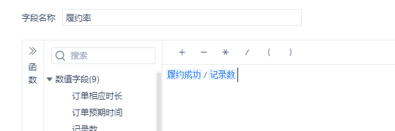

### 8、可视化报告

#### 8-1 图表选择

- 仪表板制作中，如何选择合适的图表来展示，是可视化分析的重要一部分，所以，团队在事先根据每个组件需要表达的意图和分析思路，研讨出适合的可视化图表，为整体的可读性、展示性加分。

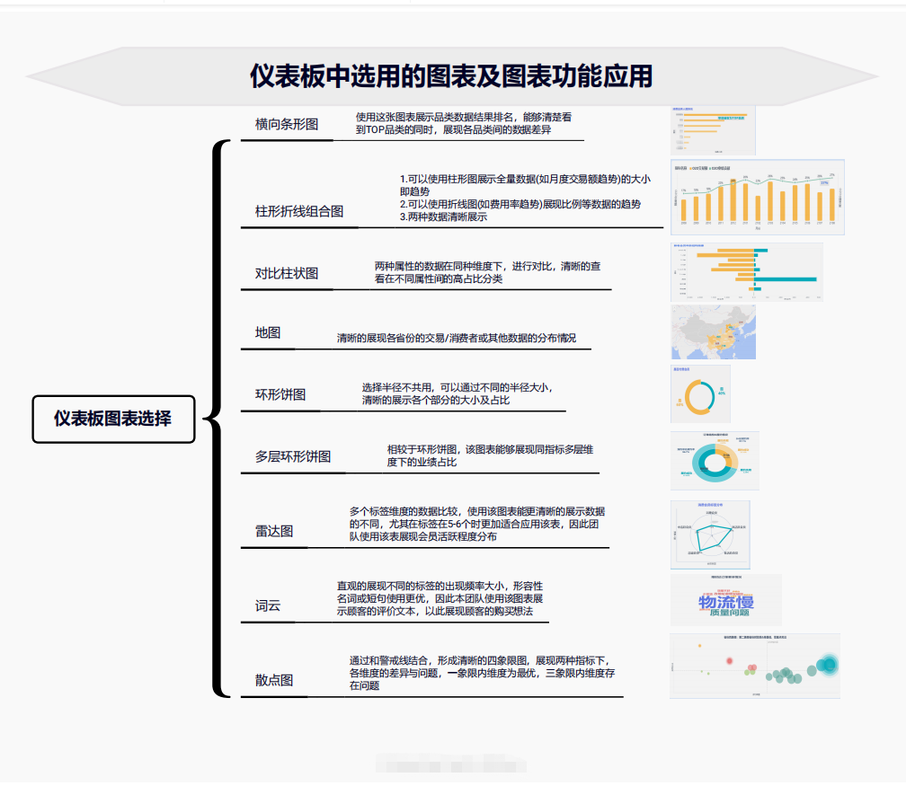
#### 8-2 颜色及设置

- 本分析为O2O相关分析，可应用场景为运营相关业务同事直观查看分析结果，并且由于O2O业务为新兴互联网产品，年轻人为主要用户，因此本分析使用主色调为明黄和蓝绿色，展现出活力快乐的氛围。

#### 8-3 报告内容

- **8-3-1 概览**
  - 意义：使仪表板使用者在阅读分析初始，对O2O业务的业绩现状有整体的概念，同时也能清晰查看业绩情况
  - 内容概述：本模块为O2O业务的交易概览，使用KPI卡片和趋势图直观的展现业绩指标以及业绩指标趋势。
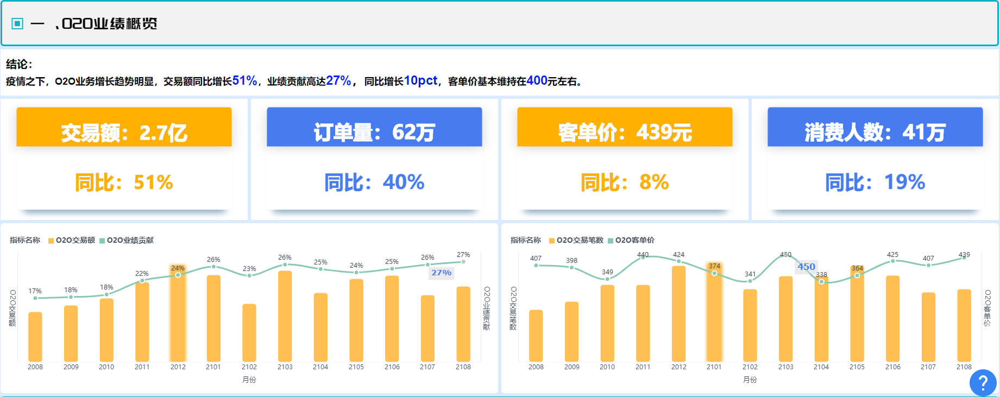
- **8-3-2 用户偏好分析**
  - 意义：对O2O用户进行初步的画像，为业务以及决策者提供O2O用户在各个指标维度下的消费偏好，能够帮助分析用户找到触达会员，转化会员消费的机会点。
  - 内容概述：本模块展示了区域维度，付费会员，新老会员，年龄段等会员标签的经营结果占比，形成会员画像；同时增加会员消费商品或服务的人群数据，以此分析会员在O2O平台上的消费偏好；最后还展示了业绩TOP和LAST门店，帮助业务或一线组织者寻找O2O经营优秀的对标门店以及存在经营问题的门店，进行相关帮助。
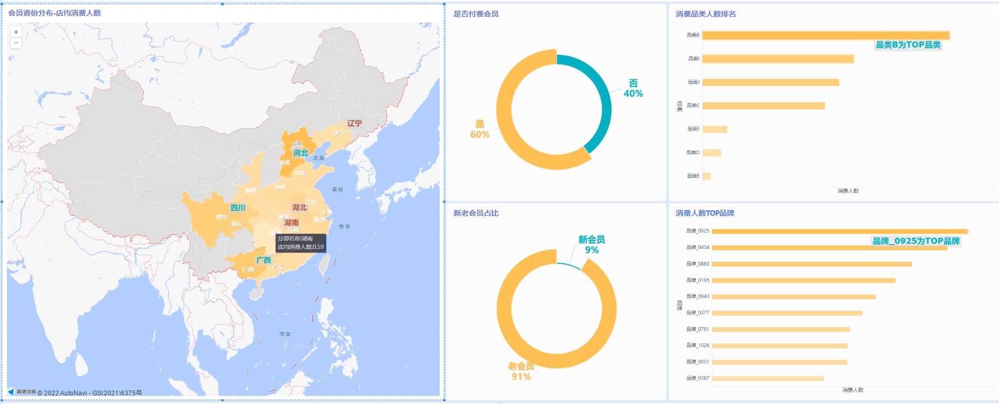
- **8-3-3 限时达服务质量分析**
  - 意义：对限时达订单的部分进行细致分析，从订单分布到履约结果，再到整个订单时长，最后看客户端反馈情况，全流程反应限时达服务质量
  - 内容概述：本模块主要展示了限时达订单量情况，2H达订单及预约单情况，同时分析了订单时效的每个环节花费的时间，找出其中关键问题，针对性解决。并且直面用户评价，找到顾客不满意的原因，帮助业务后续制定改善方案，全方位提升O2O服务质量.
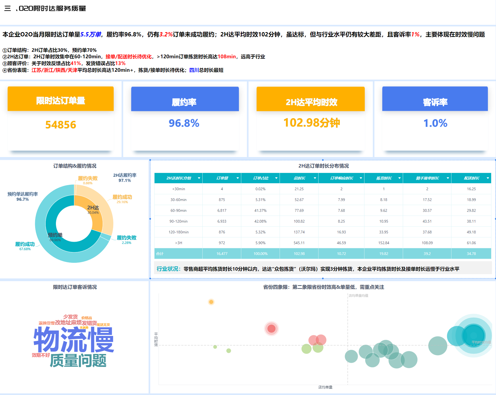
- **8-3-4 成本分析**
  - 意义：对O2O的成本进行详细的分析，从单均订单成本、物流费率两个指标，找到可以实现O2O降本增效的机会点。
  - 内容概述：本模块主要展示了O2O物流成本情况，从订单结构（距离、是否跨省两个维度）承运商结构差异，分析O2O成本的主要问题和可以改善的机会点，同时对于部分物流成本高的省份给予预警。
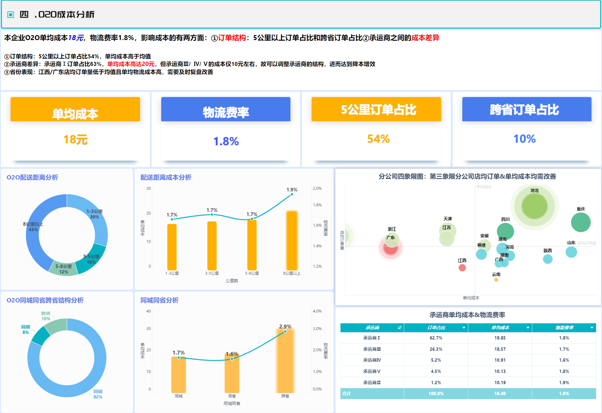
#### 8-4 报告整体呈现

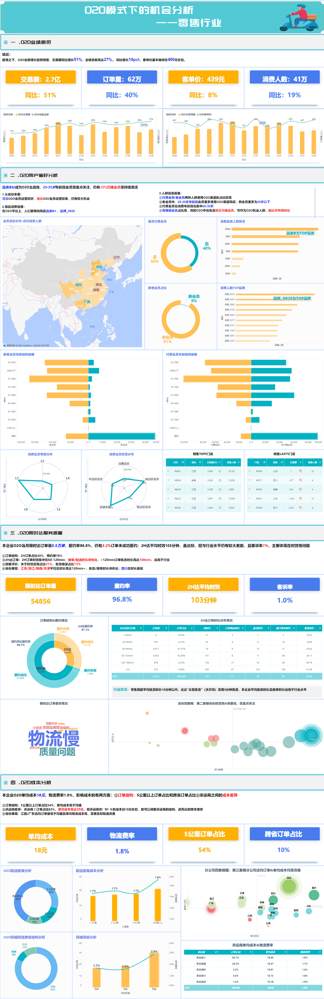
